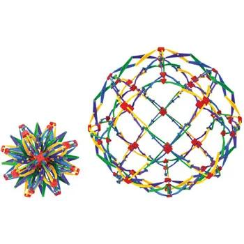

**U-SIE Sovereign Platform**

AUTHORS

Chief Architect

Fred Laurenzo

AI Technical Review and Code Contribution

OpenAI ChatGPT

AI Technical Review and Primary Code Contribution

Google Gemini

AI Review

Anthropic Claude, Proton Lumo, X Grok, Microsoft CoPilot

## Independent Development Statement

U-SIE developed through an author-initiated “what-if” design process.
Architectural premises were introduced iteratively by the author and
subsequently explored, analyzed, organized, challenged, implemented, and
refined with AI assistance. AI contributed analysis, synthesis,
implementation support, and original suggestions during that process;
however, the architectural development was not initiated through
prior-art research or an attempt to reproduce an existing reference
architecture. The concepts were personally novel to the author when
introduced.

The absence of citations in this document should therefore not be
interpreted as a claim that every individual concept is novel. Rather,
it reflects the fact that the architecture was developed independently
before a comprehensive review of related work was undertaken.

The contribution claimed by this document is the U-SIE architectural
synthesis, organization, deterministic structural-processing framework,
and reference implementation presented here. Specific performance,
security, and inference claims are treated as hypotheses or experimental
results where applicable and are not implied merely by description of
the architecture.

**U-SIE Stewardship Principle**

*The purpose of U-SIE is to establish and preserve an open architectural
foundation that encourages innovation, competition, and independent
implementation. The project welcomes commercial and non-commercial use
by individuals, researchers, nonprofits, and businesses of all sizes.
Its long-term objective is to foster a diverse ecosystem of independent
developers and organizations while helping ensure that the foundational
architecture remains openly available rather than becoming concentrated
under the control of a few entities.*

# 

How to Cite U-SIE

If you utilize the Unified Sovereign Intake Engine (U-SIE)
reference implementation, the 3D lattice state model, deterministic
processing architecture, or the PrivacyFlow CRM application layer in
your research, publications, or software benchmarks, please use the
following citation formats.

BibTeX

@software{Laurenzo_USIE_2026, author = {Laurenzo, Fred}, title =
{{Unified Sovereign Intake Engine (U-SIE): Reference Architecture & 3D
Lattice Specification}}, month = aug, year = 2026, publisher =
{GitHub}, version = {1.0.0}, url =
{<https://github.com/fredlaurenzo/U-SIE>} }

USIE_SovereignPlatform_HUD_v6.py

Citation File Format (CFF)

cff-version: 1.2.0

authors:

- family-names: "Laurenzo" given-names: "Fred" title: "Chief Architect"

title: "Unified Sovereign Intake Engine (U-SIE): Reference Architecture
& 3D Lattice Specification"

USIE_SovereignPlatform_HUD_v6.py

version: 6

date-released: 8/16/2026

url: "https://github.com/fredlaurenzo/U-SIE"

repository-code: "https://github.com/fredlaurenzo/U-SIE"

keywords:

- "sovereign ai"

- "deterministic ai preprocessing"

- "structural triangulation"

- "informatic mass"

- "deterministic validation"

- "privacy by design"

- "local ai"

- "stochastic reasoning"

license: "Apache-2.0"

**Copyright and Provenance**

Copyright © March 2026 Fred Laurenzo.

**Copyright © March 2026 Fred Laurenzo.**  
U-SIE was documented in March 2026 and subsequently accepted for posting
on SSRN in April 2026. Exact publication metadata will be supplied from
the author's SSRN record in the provenance section.

The April 2026 SSRN publication forms part of the historical provenance

of the U-SIE work. Its subsequent withdrawal does not change the date

on which that version of the work was made publicly available.

Later reference implementations, documentation, testing, and revisions

preserve this development history while carrying their own respective

version and release dates.

## From the Chief Architect

This project would not exist without collaboration.

As an independent entrepreneur and systems architect, I did not have the
benefit of large research teams, institutional funding, or dedicated
engineering groups. Instead, I relied on an iterative process of
questioning, analysis, experimentation, implementation, and continuous
refinement.

Throughout the development of U-SIE, I intentionally encouraged people
and AI systems alike to critically examine my ideas—not simply to
validate them, but to challenge them. Assumptions were questioned,
alternatives were explored, weaknesses were exposed, and many ideas were
revised or discarded. I believe this process strengthened both the
architecture and its documentation.

Artificial intelligence systems, including ChatGPT (OpenAI) and Gemini
(Google), were used as collaborative engineering assistants. Their
contributions included technical discussion, architectural critique,
code review and contribution, documentation refinement, alternative
design exploration, and assistance translating architectural concepts
into clearer engineering language. They were encouraged to provide
critical analysis rather than agreement.

As an independent architect, those perspectives significantly influenced
the evolution, iteration, organization, implementation, and clarity of
this work. Their assistance helped me examine my own assumptions from
viewpoints I could not always provide by myself.

All final architectural, implementation, documentation, and code
decisions, however, were made by me. I accept full responsibility for
the contents of this reference architecture and its implementation.

I believe good engineering is strengthened by honest collaboration,
respectful disagreement, experimentation, and a willingness to
continuously learn. If this work contributes anything of lasting value,
it is because it was built through that process.

**— Fred Laurenzo**  
Chief Architect, U-SIE

Early versions of concepts that would later contribute to U-SIE date to
**February 2025**. Development of the U-SIE architecture began in
**August 2025**. Portions of the developing architecture were
subsequently documented in a patent filing dated **February 11, 2026**,
which forms part of the project's historical development record.
Additional documentation followed in **March 2026**, and a version of
the work was accepted for posting on SSRN in **April 2026** and later
withdrawn by the author.

The public reference architecture, source code, documented revision
history, and associated research record represent the current
description of U-SIE.

Feb 2025↓

Aug 2025↓

Feb 11, 2026↓

Mar 2026↓

Apr 2026↓

Aug 2026​ early precursor concepts

U-SIE architectural development 

begins patent filing

additional formal documentation SSRN

 record current reference architecture​

### **Design Philosophy**

U-SIE was intentionally designed to minimize unnecessary complexity,
duplication, and dependencies. Throughout its development, architectural
decisions favored widely supported standards, modular components,
deterministic processes where appropriate, and incremental
extensibility. The objective was to enable adoption by individuals,
researchers, nonprofits, and small organizations without requiring large
infrastructure investments or proprietary technology stacks.

At the same time, the architecture was designed to maintain a high
standard of functionality, analytical capability, AI interoperability,
and extensibility. The goal was not simply to build a smaller or less
expensive system, but to provide an architecture capable of supporting
sophisticated data organization, deterministic structural processing,
and AI-assisted reasoning while remaining accessible to organizations
with limited technical or financial resources.

U-SIE therefore follows a simple design principle:

**Complexity should be introduced only when it performs a necessary
function that cannot be provided by the existing architecture.**

### **AI Collaboration and Complementary Skills**

**The development of U-SIE has been deeply assisted by artificial
intelligence, and the author does not regard that contribution as
incidental. The architecture originated through an author-directed,
iterative “what-if” design process in which the underlying system was
conceived primarily as a spatial and relational construct rather than as
a linear written specification.**

**AI provided a complementary capability: helping translate those mental
constructs into language, diagrams, subsystem definitions, technical
nomenclature, code, and increasingly precise architectural
specifications.**

**The balance of contribution varied throughout development. At times,
the author drove rapid sequences of architectural decisions while AI
helped capture, organize, analyze, and formalize them. At other times,
AI contributed substantial analysis, synthesis, alternative
formulations, and original insights that materially improved the
resulting work.**

**The collaboration was therefore neither AI-generated nor
AI-incidental. It was a complementary process in which human
architectural conception and judgment were combined with AI's ability to
articulate, analyze, synthesize, and rapidly explore those constructs.**

**The author could not reasonably have translated and developed the
architecture to its present level of resolution without that
collaboration. Likewise, the resulting work should not obscure the
author-originated paradigm from which that collaboration proceeded.**

**U-SIE evolved through resolution rather than reinvention: the
underlying construct remained comparatively stable while human and
artificial intelligence together made its layers increasingly visible,
explicit, and implementable.**

**AI Drafting and Documentation Note: Much of the written language in
this document, including the preceding description of the collaborative
process, was drafted by OpenAI ChatGPT from architectural concepts,
decisions, corrections, source materials, and discussions provided or
developed with Fred Laurenzo. In many instances, ChatGPT was given
minimal guidance regarding wording and no directive regarding the
conclusions it should reach. ChatGPT was permitted to organize,
critique, synthesize, and characterize the material independently. Fred
Laurenzo reviewed the resulting work and retained final authority over
its inclusion, modification, or rejection.**

**This distinction is intentional. The underlying U-SIE architecture was
developed through an iterative human-AI collaboration, while much of the
task of translating that architecture into a coherent written technical
specification was performed by AI. The document therefore seeks to
disclose AI participation rather than obscure it.**

### **Privacy Principle**

**Structuralintel.org Inc. believes that privacy has become scarce, and
scarcity gives privacy value. Privacy is therefore not merely a
constraint on technology; it is something of value that can be made
accessible through better architecture.**

Privacy is a **foundational construct of the U-SIE paradigm**, rather
than an optional feature applied after processing. The intended function
of the reference architecture and its code depends upon the successful
implementation of that privacy construct throughout the applicable
processing boundary.

U-SIE is designed around the principle that customer-owned data should
remain under the control of the customer and within the customer's
deployment boundary. Use of U-SIE does not make customer-owned data an
asset of U-SIE, the U-SIE project, or another implementation.

The architecture further seeks to preserve persistent architectural
identity and information utility without requiring the real-world
identity of the source to become part of the ordinary analytical
representation. Where legitimate identity resolution is required, the
Privacy Policy places that association outside the ordinary analytical
representation and subjects it to the implementers authorization,
privacy, consent, security, and regulatory requirements.

Accordingly, an implementation that materially defeats or bypasses these
privacy boundaries may still reuse portions of the U-SIE code, but it
should not be assumed to preserve the intended privacy behavior of the
U-SIE reference architecture.

**Structuralintel.org Inc. believes that privacy has become scarce, and
scarcity gives privacy value. Privacy is therefore not merely a
constraint on technology; it is something of value that can be made
accessible through better architecture.**

Privacy is a **foundational construct of the U-SIE paradigm**. It is not
an optional feature applied after processing. The intended function of
the U-SIE architecture and reference code depends upon successful
implementation of that privacy construct throughout the applicable
processing boundary.

**Our goal is to make meaningful privacy more accessible to everyone—not
by making data less useful, but by designing systems that can preserve
the value and utility of information without requiring unnecessary
collection of customer-owned data.**

**The customer's data is not the product. Privacy can be part of the
value of the product.**

**Privacy does not require destroying information value.**

These principles are reflected in the U-SIE Privacy Policy, which states
that customer-owned data is intended to remain under the customer's
control and within the customer's deployment boundary and that use of
U-SIE does not make customer-owned data an asset of the U-SIE project or
another implementation.

### **Customer-Owned Data / Non-Collection Principle**

**See** PRIVACY_POLICY.md**.**

### **Architect's Disclosure**

U-SIE represents the architect's first attempt at formally documenting a
software architecture and orchestrating the writing and implementation
of its reference code. The architect has no formal training in software
architecture or software engineering, had no dedicated development
budget, and has had no human technical development or review team
guiding the work.

Mistakes, omissions, untested assumptions, and areas requiring
correction or improvement are therefore likely and should be expected.
Claims requiring experimental validation should be treated accordingly.

Multiple independent AI systems were used collaboratively to examine the
architecture, identify potential weaknesses, challenge assumptions,
assist with organization and implementation, contribute code and
technical analysis, and explore alternative approaches. AI participation
was substantial and is disclosed throughout this document where
relevant.

**The originating architectural paradigm and its direction were
introduced by the architect. Its subsequent development was
collaborative.** AI systems contributed materially to the analysis,
articulation, implementation, refinement, and resolution of that
architecture, while the architect retained final authority over
architectural decisions and what was accepted, rejected, modified,
tested, or published.

Contributors are encouraged to examine the architecture critically,
identify weaknesses, reproduce the experiments, challenge the
hypotheses, test the reference implementation, and improve the work.

### **Engineering Methodology**

**Throughout development, I encouraged AI systems to challenge my
assumptions rather than simply confirm them. The architecture evolved
through iterative critique, alternative proposals, implementation
experiments, and repeated revision. Ideas were accepted based on
technical merit rather than their source. I believe this process
produced a stronger and more transparent reference architecture.**

**U-SIE began as a personal research project exploring whether local,
owner-controlled AI systems could become more practical through
deterministic structural processing, multidimensional state
representation, privacy-oriented architecture, and efficient retrieval.
It is released as an open reference implementation so that other
developers, researchers, educators, nonprofits, and businesses can study
it, benchmark it, improve it, and adapt it to problems that have not yet
been imagined.**

**Here's a workshop. Come in. Run the benchmarks. Break it. Improve it.
Publish your results. If you find a better structural representation,
fantastic. If you find a faster retrieval method, even better.**

**U-SIE is meant to be a starting point, not an endpoint. If the
community discovers better token organizations, structural
representations, storage layouts, retrieval methods, validation methods,
measurement equations, or inference pipelines, those improvements are
part of the project's purpose.**

**The published reference implementation should nevertheless remain
available as a frozen experimental baseline. Improvements and
alternative implementations should be versioned or documented separately
so their results can be compared against a common reference rather than
silently altering the control.**

**If future developers replace every algorithm, redesign every token, or
discover a better architecture through open and reproducible
experimentation, U-SIE has succeeded.**

**U-SIE does not claim to originate every individual concept
incorporated into the architecture. Rather, it presents a particular
architectural synthesis of engineering principles, deterministic
structural processing, multidimensional object representation,
measurement and validation, privacy-oriented design, and preparation of
structured information for downstream AI reasoning.**

### **Benchmarking and Experimental Limitations**

**U-SIE has been developed and tested under the practical constraints of
an independent research effort. The author has not had access to a
dedicated engineering team, controlled laboratory environment, broad
hardware inventory, or the funding necessary to rigorously isolate every
experimental variable.**

**As a result, benchmark results published with this project should be
interpreted as reference observations from the documented test
environment, not as universal performance guarantees.**

**Careful notes, hardware specifications, software versions, procedures,
source code, test data, equations, baseline conditions, and relevant
implementation details are provided wherever practical so that other
researchers and developers can reproduce the tests, identify
uncontrolled variables, modify experimental conditions, and conduct
independent benchmarking on their own systems.**

**The purpose of publishing these results is not to claim final or
definitive performance characteristics, but to provide a transparent and
reproducible starting point for further evaluation.**

**Where subsequent testing identifies additional variables, limitations,
failed hypotheses, or contradictory results, those findings are welcomed
as part of the continued evaluation of the architecture.**

**The reference implementation and accompanying case study are intended
to establish a frozen, transparent baseline for independent validation,
falsification, optimization, and extension by the broader engineering
and research communities.**

##  **Engineering Invitation**

**U-SIE is offered as a reference architecture to be examined,
challenged, tested, benchmarked, and improved.**

**If you discover a better approach, implement it. Test it rigorously.
Benchmark it transparently. Document your methodology and publish your
results so others may reproduce them.**

**If your contribution advances the architecture, please leave it for
the community and cite your work. Your ideas deserve recognition, and
future architects deserve to understand where those ideas originated.**

**Progress is built through collaborative engineering. Every thoughtful
contribution has the potential to strengthen the architecture for those
who follow.**

**Plant the seed. Share the work. Test the ideas. Cite the contributors.
Leave the architecture stronger than you found it.**

**License**

**Copyright 2026 Fred Laurenzo**

**Licensed under the Apache License, Version 2.0 (the "License");**

**you may not use this file except in compliance with the License.**

**You may obtain a copy of the License at**

[https://www.apache.org/licenses/LICENSE-2.0](http://license/)

**Unless required by applicable law or agreed to in writing, software**

**distributed under the License is distributed on an "AS IS" BASIS,**

**WITHOUT WARRANTIES OR CONDITIONS OF ANY KIND, either express or
implied.**

**See the License for the specific language governing permissions and**

**limitations under the License.**

========================================================================

IMPORTANT NOTICE

REFERENCE IMPLEMENTATION & DEPLOYMENT DISCLAIMER

========================================================================

ATTENTION RESEARCHERS, DEVELOPERS, AND SYSTEM ADMINISTRATORS:

1\. NOT ENTERPRISE-HARDENED

The code and documentation contained within this repository represent a

PUBLIC REFERENCE IMPLEMENTATION of the Unified Sovereign Intake Engine

(U-SIE) architecture and MSPD -Multistate Point Display or PrivacyFlow
CRM framework.

This implementation is designed to demonstrate the reference
architecture,

3D lattice state model, deterministic processing and validation,
canonical

state handling, MSPD integration, measurement, packaging, and
preparation

of structured information for downstream AI reasoning.

It is NOT enterprise-hardened software and is NOT optimized or secured

out-of-the-box for production environments.

2\. SECURE DEPLOYMENT & ENVIRONMENT REQUIREMENTS

• Experimental deployments should occur within appropriately isolated,

sandboxed, and firewalled execution environments.

• Public API exposure should be strictly limited and protected by

appropriate authentication, rate limiting, secure gateways, and other

environment-specific controls.

• Any production deployment requires independent security review,

penetration testing, concurrency/thread-safety review, privacy review,

and environment-specific hardening.

• The optional gateway and enhanced PII/privacy mechanisms documented

with this project are experimental extensions and should not be assumed

to provide production security or regulatory compliance without

independent evaluation.

3\. WORK IN PROGRESS / EXPERIMENTAL SPECIFICATION

This technical documentation and reference implementation remain part of

an active research and engineering effort.

The published reference baseline is intended to remain reproducible.

Proposed improvements, alternative algorithms, optional gateway
controls,

enhanced PII processing, additional token/state divisions, KPI
equations,

AI context-packet strategies, recovery mechanisms, and distributed or

multi-node implementations should be treated as experimental extensions

unless incorporated into a separately versioned reference release.

Performance, privacy, security, inference, and scalability
characteristics

remain subjects for reproducible testing and independent evaluation.

4\. "AS IS" DISCLAIMER & LEGAL LIMITATION OF LIABILITY

THIS SOFTWARE AND ACCOMPANYING DOCUMENTATION ARE PROVIDED "AS IS",

WITHOUT WARRANTY OF ANY KIND, EXPRESS OR IMPLIED, INCLUDING BUT NOT
LIMITED TO THE WARRANTIES OF MERCHANTABILITY, FITNESS FOR A PARTICULAR
PURPOSE, AND NON-INFRINGEMENT.

IN ACCORDANCE WITH THE APACHE LICENSE, VERSION 2.0, NEITHER THE CHIEF

ARCHITECT, CONTRIBUTORS, NOR ASSOCIATED ENTITIES ASSUME RESPONSIBILITY

OR LIABILITY FOR DEPLOYMENT, OPERATION, DATA LOSS, PRIVACY EXPOSURE,

SECURITY INCIDENTS, OR OTHER CONSEQUENCES ARISING FROM USE OR
MODIFICATION OF THIS CODEBASE.

USERS ARE RESPONSIBLE FOR EVALUATING THE SOFTWARE AND THE RISKS
ASSOCIATED WITH THEIR PARTICULAR IMPLEMENTATION.

========================================================================

REFERENCE ARCHITECTURE

This repository contains the public reference implementation of the

Unified Sovereign Intake Engine (U-SIE).

The accompanying README serves as technical documentation and an
engineering

decision record for the project.

Architectural decisions should be documented together with their
rationale,

implementation status, experimental status where applicable, and
relationship

to the reference code.

The published baseline and accompanying case study provide a common
reference

against which modifications and alternative implementations may be
tested.

U-SIE/

│

├── USIE_SovereignPlatform.py

│

├── README.md

│ (technical documentation and engineering decision record)

│

├── PRIVACY_POLICY.md

├── LICENSE

│

├── CHANGELOG.md

│

└── examples/

**The U-USIE Methodology**

MEASURE → TRIANGULATE → VALIDATE → MEASURE → ANALYZE → PACKAGE → 

PACKETS → AI STOCHASTIC REASONING

<table>
<colgroup>
<col style="width: 31%" />
<col style="width: 45%" />
<col style="width: 22%" />
</colgroup>
<thead>
<tr>
<th style="text-align: center;">Stage</th>
<th style="text-align: center;">Function</th>
<th style="text-align: center;">Character</th>
</tr>
</thead>
<tbody>
<tr>
<td><strong>1. MEASURE</strong></td>
<td>Establish (U_L) / admitted Informatic Mass</td>
<td><strong>DETERMINISTIC</strong></td>
</tr>
<tr>
<td><strong>2. TRIANGULATE</strong></td>
<td>Establish the three-anchor structural point</td>
<td><strong>DETERMINISTIC</strong></td>
</tr>
<tr>
<td><strong>3. VALIDATE</strong></td>
<td>TK9: (S_{\text{in}}=S_{\text{out}}) → Y/NTK9: Σ(in) = Σ(out) →
Y/N</td>
<td><strong>DETERMINISTIC</strong></td>
</tr>
<tr>
<td><strong>4. MEASURE</strong></td>
<td>TK10: KPI benchmark and point relationships</td>
<td><strong>DETERMINISTIC</strong></td>
</tr>
<tr>
<td><strong>5. ANALYZE</strong></td>
<td>Apply defined equations to validated measurements</td>
<td><strong>DETERMINISTIC</strong></td>
</tr>
<tr>
<td><strong>6. PACKAGE</strong></td>
<td>Assemble the validated analytical representation for inference</td>
<td><strong>DETERMINISTIC</strong></td>
</tr>
<tr>
<td>
<strong>7. PACKETS</strong>

<strong>___________________________</strong>

<strong>8. AI STOCHASTIC REASONING</strong>
</td>
<td>
<strong>Create bounded AI-ready information packets from the
validated package</strong>

<strong>_______________________________________</strong>

<strong>Infer, reason, synthesize, generate
conclusions</strong>
</td>
<td>
<strong>DETERMINISTIC</strong>

<strong>___________________</strong>

<strong>STOCHASTIC</strong>
</td>
</tr>
</tbody>
</table>

**U-SIE deterministically measures, triangulates, validates, remeasures,
analyzes, packages, and packetizes structural information.** **Only
after those operations are complete are the resulting information
packets presented to the AI for stochastic reasoning.**

### Decision 001 for the README

**Decision 001 — Universal Object Representation**

All objects entering U-SIE SHALL be converted to a common byte
representation before Universal Intake. The object feeder SHALL package
those bytes with only the declared media type, intake source, and
permitted declared metadata.

The object feeder SHALL NOT perform PII processing, semantic
classification, identity assignment, token generation, routing,
lifecycle decisions, or storage decisions.

**Rationale:** A common byte boundary allows heterogeneous objects to
enter the same architecture without requiring the core intake system to
understand their native format.

**Development Note — Laurenzo & Gemini. Original conception: March 28,
2026; ChatGPT technical formalization: Aug. 14, 2026.** The underlying
left-to-right U-SIE methodology and processing sequence originated
through Laurenzo–Gemini architectural development on March 28, 2026.
ChatGPT subsequently recovered, organized, and formalized the sequence
into the deterministic/stochastic stage model shown here and contributed
refinements during architectural review. Laurenzo constructed and
revised the published chart and approved its final form.

**Development Note — Laurenzo & ChatGPT, Aug. 14, 2026.** Core U-SIE
processing flow developed from Laurenzo's architectural methodology and
collaboratively resolved through iterative review. ChatGPT organized and
formalized the methodology into the staged deterministic/stochastic
presentation; Laurenzo constructed the published chart, directed
revisions, and approved the final representation.

**Specific Collaboration Note — Laurenzo & ChatGPT, Aug. 14, 2026.** The
explicit separation of deterministic structural processing from
stochastic AI reasoning was collaboratively formalized during
architectural review.

### **Optional Gateway Architecture**

**The gateway is not a required component of the core U-SIE
architecture. It is an optional deployment layer that may be added where
an implementation requires an external security, identity, transaction,
or integration boundary.**

When implemented, the gateway serves as a controlled interface between
external systems and the internal U-SIE architecture. It may provide a
security boundary while also serving as a stable integration point for a
wide variety of external applications and services.

Depending on deployment requirements, the gateway architecture may
support:

- Secure intake of external objects and transactions.

- Integration with payment providers and other trusted services.

- Customer-facing portals.

- Supplier and vendor portals.

- Institutional and enterprise systems.

- Standardized import and export through open interchange formats such
  as CSV.

- Controlled identity re-association for authorized workflows.

- Migration from existing software systems without requiring wholesale
  replacement.

- Gradual adoption, allowing organizations to integrate one workflow at
  a time while preserving existing business operations.

The gateway architecture is intentionally modular. Organizations may
implement only the interfaces required for their environment while the
internal U-SIE architecture remains unchanged.

**Gateway implementations should therefore be evaluated independently
from the U-SIE reference baseline. An implementation may add, replace,
or omit the gateway without altering the core structural processing
architecture.**

### **External Access-Control Boundary**

**U-SIE does not prescribe an external authentication, authorization,
credential-management, identity-verification, or account-recovery
architecture. Access to a U-SIE implementation is controlled by the
deploying organization through its selected gateway, provider, and
security architecture. Integration with those systems is
implementation-specific and outside the core U-SIE architecture.**

**External access-control integration has been demonstrated functionally
in prototype implementations; those implementations are neither
prescribed nor evaluated as part of the U-SIE architecture.**

**Development Note — Laurenzo; ChatGPT architectural classification,
Aug. 14, 2026. The gateway architecture and its role as an external
interface to U-SIE were conceived by Fred Laurenzo as part of the U-SIE
architecture. During review on Aug. 14, 2026, ChatGPT proposed formally
classifying the gateway as an optional deployment layer rather than a
required component of the U-SIE core architecture. Laurenzo reviewed and
adopted that classification. No claim of gateway implementation-code
authorship is made by this note.**

# **Step 1 — Universal Ingest and Structural Measurement**

U-SIE begins with a heterogeneous digital object and converts it into a
deterministic, measurable structural state. The original file format
does not create a separate architectural processing path. Once admitted,
the object enters the common U-SIE byte-level intake process.

## **1.1 Ingest Flow**

| Event / Stage | Definition / Function | Character | Result |
|----|----|----|----|
| **MIXED OBJECT** | Any supported digital object may enter U-SIE, including PDF, DOCX, ODT, CSV, TXT, JPEG, PNG, other images, structured records, transactions, sensor records, or other supported digital objects. | **INPUT EVENT** | Source object |
| **UNIVERSAL OBJECT FEEDER** | Accepts the incoming object and presents its machine representation to the common U-SIE intake path. The feeder does not determine the object's business meaning or perform AI inference. | **DETERMINISTIC** | Object presented for ingest |
| **BYTES** | Represents the admitted object at the common machine level. The original byte quantity may be recorded as Bin​ to preserve an objective measurement of what physically entered the system. | **DETERMINISTIC** | Byte stream + Bin​ |
| **BYTE ROUTER / TK0** | Applies the configured deterministic intake and privacy rules. Byte-level content permitted to continue is separated from content prohibited from entering the persistent structural representation. TK0 performs the transient intake-boundary function. | **DETERMINISTIC** | Admitted byte state |
| **INFORMATIC UNITIZATION** | Divides the admitted information according to the applicable baseline Informatic Unit definition—for example, paragraphs, pixel groups, code-line groups, or spatial units. | **DETERMINISTIC** | Countable Informatic Units |
| **INFORMATIC UNIT WEIGHT** | Counts the resulting Informatic Units and applies the applicable domain calibration to establish the measured input weight. | **DETERMINISTIC** | Win​ |
| **EXPERIMENTAL REDUCTION** | Applies the baseline reduction factor f. The initial reference value is f=0.90, representing an experimental expectation of 90% reduction and 10% retained information. | **DETERMINISTIC OPERATION / EXPERIMENTAL PARAMETER** | Wretained​ |
| **LAURENZO–GEMINI STRUCTURAL MEASUREMENT** | Uses the measured domain, logical-value, and temporal components to establish Informatic Mass UL​, then expresses participating token-state contributions on the common Uϕ​ measurement basis. | **DETERMINISTIC** | UL​ + structural contributions |
| **FORM TOKEN STATE** | Creates the participating TK1–TK10 structural state. The mathematical architecture remains open to n; TK1–TK10 therefore describes the present reference implementation rather than an absolute mathematical limit. | **DETERMINISTIC** | T1​...Tn​ |
| **ESTABLISH SUM IN** | Adds the participating token-state contributions to establish the original structural reference Sin​, which is frozen as S0​. | **DETERMINISTIC** | Sin​=S0​ |
| **TRIANGULATE** | Uses the three primary structural dimensions C, V, and T, represented through TK1, TK2, and TK3 in the current baseline, to establish the object's primary position in U-SIE's 3D structural state space. | **DETERMINISTIC** | P=(TK1,TK2,TK3) |
| **NEXT: TK9 VALIDATION** | The completed structural state is independently remeasured and compared with the frozen input state. | **DETERMINISTIC** | Validation input |

The first processing movement can therefore be represented as:

OBJECT→BYTES→ROUTE→UNITIZE→WEIGH→REDUCE→MEASURE→FORM STATE→S0​→TRIANGULATE​

# **1.2 Informatic Units**

U-SIE requires unlike forms of information to become deterministically
measurable before they can participate in a common structural state.

The baseline accomplishes this by assigning a defined primitive
**Informatic Unit** to each supported information domain.

Historical examples include:

| Information domain              | Experimental baseline unit |
|---------------------------------|----------------------------|
| **PDF / textual information**   | **1 paragraph = 1 unit**   |
| **Image / imaging information** | **100 pixels = 1 unit**    |
| **Binary / code information**   | **10 lines = 1 unit**      |
| **Geospatial information**      | **1 m² = 1 unit**          |

These values originated as experimental calibration units. They are
retained in the reference baseline so that they can be tested rather
than silently replaced during reconstruction. They are **not claimed to
be universal or optimal constants**.

The historical architecture explicitly describes assigning units to
otherwise different data primitives so that they can become measurements
of a common Informatic Mass.

# **1.3 Informatic Unit Weight**

Let:

NU​=number of Informatic Units measured

and:

Cdomain​=applicable baseline domain calibration

The initial Informatic Unit Weight is:

Win​=NU​×Cdomain​​

For example, if a textual object contains 40 admitted paragraphs and:

1 paragraph=1 Informatic Unit

then:

NU​=40

If the applicable experimental calibration is:

Cdomain​=1.0

then:

Win​=40×1.0

and:

Win​=40​

The number 40 is not asserted to be a physical mass or universal measure
of the object's value. It is a **repeatable measurement produced under a
declared unit definition and calibration**.

That distinction is fundamental: the baseline can be reproduced,
measured, challenged, and replaced without changing the architectural
requirement that the incoming state first be made measurable.

# **1.4 Experimental Reduction Factor f**

The original architecture anticipated that a substantial portion of an
incoming object's representation could be removed while retaining its
useful structural information. The historical baseline proposed
approximately **90% reduction / 10% retention**.

For the reference experiment:

f=0.90​

where:

f=expected reduction fraction

The retained Informatic Unit Weight is therefore:

Wretained​=Win​(1−f)​

At the initial experimental value:

Wretained​=Win​(1−0.90)

therefore:

Wretained​=0.10Win​​

Using the preceding 40-unit example:

Wretained​=40(0.10) Wretained​=4​

## **Experimental Limitation**

**The value f=0.90 is an experimental baseline, not an architectural
constant or validated optimum. The 90% value originated during earlier
architectural development and has not yet been adequately tested across
object types and domains to determine whether the resulting retained
structural information permits satisfactory reinflation.**

**The reference implementation therefore preserves 90% as an initial
test condition rather than assuming its correctness. Experimental
evaluation should determine whether adequate reinflation occurs at 90%
reduction and whether another value, a domain-specific value, or another
deterministic reduction method produces superior results.**

Accordingly:

Reduction capability = architectural​

but:

f=0.90=experimental​

and:

Reinflation adequacy = measured outcome​

The historical source itself described the 90/10 division as removal of
approximately 90% Informatic Drag while retaining approximately 10%
signal. The present reference architecture treats that proportion as a
hypothesis to be tested rather than as an established law.

# **1.5 Laurenzo–Gemini Informatic Mass**

After unitization and application of the experimental reduction
condition, U-SIE establishes the measured structural state.

The historical Informatic Mass formulation is:

UL​(d)=f(Cdomain​,Vlogical​,Ttemporal​)​

where the original formulation defines:

Cdomain​=domain constant/calibration Vlogical​=logical-value vector
Ttemporal​=temporal/cycle-weight component

and:

UL​(d)=Informatic Mass of data element d

The historical source states this formulation directly.

### **Notation clarification**

Because the current reference reconstruction also uses f for the
**experimental reduction fraction**, using the same symbol for both the
reduction factor and the historical function f(C,V,T) would create
ambiguity.

The historical equation is preserved when quoted; the operational
reference specification uses:

UL​(d)=f(C,V,T)

but using a distinct symbol in the operational reference specification:

UL​(d)=F(C,V,T)​

where capital F means the deterministic Informatic Mass mapping and
lowercase f remains the experimental reduction fraction.

Thus:

f=0.90experimental reduction factor​

while:

F(C,V,T)Informatic Mass mapping​

This changes **notation, not architecture**, and prevents two unrelated
operations from being represented by the same symbol.

# **1.6 Three Primary Structural Dimensions**

In the current baseline, the three components of the Informatic Mass
state map to the first three structural token dimensions:

C→TK1​ V→TK2​ T→TK3​

Therefore:

UL​(d)=F(TK1,TK2,TK3)​

at the primary three-dimensional structural level.

The three values are not merely labels. They establish three independent
dimensions through which the admitted object can be positioned
structurally.

# **1.7 Common Structural Measurement Basis Uϕ​**

Informatic Mass UL​ and the common structural measurement basis Uϕ​
perform different jobs.

UL​=measured Informatic Mass​

whereas:

Uϕ​=common Unit-of-Logic basis for structural accounting​

Each participating token/state contributes:

Ci​=Ti​⋅Uϕ​​

Thus:

C1​=T1​Uϕ​ C2​=T2​Uϕ​ C3​=T3​Uϕ​

continuing through:

Cn​=Tn​Uϕ​

Here Ti​ represents the **measurable state contribution associated with
token/state i** rather than merely the printable token identifier.

# **1.8 Laurenzo–Gemini Structural State Equation**

The participating contributions are summed:

Sin​=i=1∑n​(Ti​⋅Uϕ​)​

The original measured structural state is then frozen as:

Sin​=S0​​

giving the general structural equation:

S=i=1∑n​(Ti​⋅Uϕ​)=S0​​

The historical six-token formulation explicitly describes the audit seal
as:

S=Σ(Ti​⋅Uϕ​)

and treats alteration of the participating state as producing an
unresolved asymmetry.

The present architecture generalizes the summation from a historically
fixed token count to:

i=1,…,n​

This means the structural equation does not require an arbitrary maximum
token count.

# **1.9 Triangulation — Establishing the 3D Structural Point**

Once the initial state is measured, U-SIE establishes the primary
structural position from three independent dimensions:

C→TK1 V→TK2 T→TK3

Together:

P=(TK1,TK2,TK3)​

Conceptually:

TK3

Temporal / T

●

/ \\

/ \\

/ P \\

/ \\

●---------●

TK1 TK2

C V

The three anchors establish the primary **3D structural position** of
the object.

Additional token families may describe operational state, semantics,
relationships, evidence, financial state, validation, measurements, or
other dimensions associated with that anchored object. They do not
require creation of another object identity merely because additional
structural information exists.

### **Universal Token Expansion**

Any token family may expand when additional representational capacity is
required:

TK3→TK3a,TK3b,TK3c,…

and generally:

TKi​→TKia​,TKib​,TKic​,…​

Child tokens retain lineage to their parent token and ultimately to the
same persistent structural object.

**Token expansion adds representational capacity; it does not create a
new origin.**

## **End of Step 1**

### **Development and Source Note — Step 1**

**Architectural origin — Fred Laurenzo.** The underlying U-SIE concepts
of universal ingest, byte-level processing, deterministic PII
separation, Informatic Unitization, Informatic Mass, reduction of
Informatic Drag, tokenized structural representation, and spatial
organization originated through Laurenzo's architectural development of
U-SIE. Earlier versions of these concepts are preserved in the project's
historical development records.

**Mathematical formalization — Fred Laurenzo & Google Gemini, March 28,
2026.** The Informatic Mass framework and structural-state mathematics
were developed through Laurenzo–Gemini collaboration. The historical
record identifies the structural integrity equation as mathematically
formalized with Gemini while identifying the conceptual framework,
variable definitions, and informatic principles as originating with
Laurenzo.

**Historical experimental baseline.** The earlier U-SIE specification
documented UL​(d)=f(Cdomain​,Vlogical​,Ttemporal​), together with the 90%
Informatic Drag / 10% retained-signal hypothesis. These values and
formulations are preserved in the current reference baseline for
reproducibility and experimental evaluation rather than represented as
independently validated constants.

**Architectural reconstruction and technical documentation — Fred
Laurenzo & OpenAI ChatGPT, August 14, 2026.** Laurenzo and ChatGPT
reconstructed and reviewed the historical architecture against the
surviving primary-source materials. During that process, obsolete
intermediate components were removed, experimental assumptions were
separated from architectural requirements, the open-n structural
formulation was restored, and the ingest-to-measurement sequence was
reorganized into the present reference specification. Laurenzo supplied
and recovered architectural details from the historical development
process; ChatGPT performed source comparison, mathematical and
architectural organization, technical drafting, and consistency review.
Final architectural decisions and approval remained with Laurenzo.

**Primary Sources:** Original U-SIE white paper and mathematical
specification; March 28, 2026 Laurenzo–Gemini development record;
historical prototype/reference code; timestamped development
correspondence; and the August 14, 2026 Laurenzo–ChatGPT reconstruction
record.

## **Step 2 — Structural State and Validation**

### **Before Continuing: U-SIE Token Terminology**

**TK means Token.**

In U-SIE, a **Token (TK)** is a deterministic structural container or
reference with an assigned responsibility in the representation of an
object.

Tokens are identified by their architectural role and number. For
example, **TK1 means Token 1**, **TK2 means Token 2**, and **TK9 means
Token 9**.

The token number identifies a structural responsibility; it does not
represent processing order, importance, or a limit on the amount of
information that may be represented.

Then give them a **very small orientation table**, not another giant
chart:

| Notation | Read as | General role |
|----|----|----|
| **TK0** | Token 0 | Transient intake/privacy boundary |
| **TK1** | Token 1 | Primary structural anchor — C |
| **TK2** | Token 2 | Primary structural anchor — V |
| **TK3** | Token 3 | Primary structural anchor — T |
| **TK4–TK8** | Tokens 4–8 | Additional structural responsibilities |
| **TK9** | Token 9 | Structural validation |
| **TK10** | Token 10 | Deterministic measurement / KPI |
| **TKn** | Token n | Additional token capacity permitted by the open architecture |

Then immediately explain expansion:

### **Token Expansion**

Any token may expand when additional representational capacity is
required:

TK3→TK3a,TK3b,TK3c,…

**Expansion adds capacity to an existing token lineage. It does not
create a new object origin.**

### **Transition — From Structural Formation to Structural Validation**

Step 1 began with an external digital object and established its first
measurable U-SIE structural state. The object entered through the
Universal Object Feeder, was represented as bytes, and passed through
the deterministic byte-routing and privacy boundary. The admitted
information was then divided into defined Informatic Units and measured
using the applicable baseline Unit Weight.

The reference baseline applied the experimental reduction factor f=0.90,
while explicitly preserving that value as a test parameter rather than a
validated constant. The retained information was then measured through
the Laurenzo–Gemini Informatic Mass framework and represented through
the participating token states on the common Uϕ​ measurement basis.

Those contributions established the original structural reference:

Sin​=i=1∑n​(Ti​⋅Uϕ​)=S0​​

The primary C, V, and T dimensions were represented through TK1, TK2,
and TK3 and used to establish the object's initial three-dimensional
structural position.

At the completion of Step 1, U-SIE therefore has two things it did not
have when the object arrived: **a structured representation of the
admitted information and a frozen mathematical reference describing the
state against which that representation can be checked.**

Step 2 asks the next deterministic question:

**Did the structural state produced by U-SIE preserve the measured state
established at ingest?**

U-SIE does not answer that question by asking an AI to judge whether the
resulting object appears correct. Instead, the resulting state is
**independently measured again using the same measurement basis** and
compared with S0​.

This produces the second half of the Laurenzo–Gemini structural equation
and the function of **TK9**.

# **Step 2 — TK9 Structural Validation**

## **Step 2 — Token 9 (TK9) Structural Validation**

### **2.1 Primary Three-Coordinate Association**

Before validation, the three equivalent ways U-SIE describes its primary
structural coordinates are associated:

| Mathematical | Architectural       | Token representation |
|--------------|---------------------|----------------------|
| **C**        | **Identity**        | **Token 1 (TK1)**    |
| **V**        | **Spatial**         | **Token 2 (TK2)**    |
| **T**        | **Time / Temporal** | **Token 3 (TK3)**    |

Therefore:

C⟷Identity⟷TK1​ V⟷Spatial⟷TK2​ T⟷Time / Temporal⟷TK3​

These are not nine separate elements. They are **three structural
coordinates expressed in three different vocabularies**: mathematical,
architectural, and token.

### **2.2 Structural Validation Flow**

| Event / Stage | Definition / Function | Character | Result |
|----|----|----|----|
| **COMPLETED STRUCTURAL STATE** | Receives the state established in Step 1 at its three primary coordinates—**Identity (C/TK1), Spatial (V/TK2), and Time (T/TK3)**—together with the remaining participating token states. The original measured reference established in Step 1 remains unchanged for comparison. | **INPUT EVENT** | 3D anchored structural state + remaining TK states + original reference |
| **REMEASURE** | Independently measures the completed structural state using the same measurement rules and common basis used to establish the original state. No AI judgment or interpretation is used. | **DETERMINISTIC** | Independently measured structural state |
| **CALCULATE SUM OUT** | Combines the independently measured contributions of all participating token states to determine the completed state's total measured output. | **DETERMINISTIC** | Measured output total |
| **CALCULATE DIFFERENCE** | Compares the completed-state measurement with the original reference measurement established during Step 1. | **DETERMINISTIC** | Difference between original and completed state |
| **TOKEN 9 (TK9) — VALIDATE** | Token 9 applies the structural-validation rule. It does not determine whether the object appears reasonable or probably correct. It asks only whether the completed measurement reconciles exactly with the original reference. | **DETERMINISTIC** | Binary validation decision |
| **YES — VALID** | The completed structural state reconciles with the original measured state. The object is permitted to continue through the validated processing path. | **DETERMINISTIC** | **TK9 = YES** → Continue |
| **NO — QUARANTINE** | The completed structural state does not reconcile with the original measured state. The object is prevented from continuing through the normal validated path and is moved to quarantine for resolution. | **DETERMINISTIC** | **TK9 = NO** → Quarantine |

### **2.3 Plain-Language Flow**

COMPLETED STRUCTURAL STATE→REMEASURE→SUM OUT→COMPARE→TK9 VALIDATE→YES / NO​

Or, without any U-SIE terminology:

**Measure what came in. Build the structural representation. Measure the
completed representation independently. Compare the two measurements. If
they reconcile, continue. If they do not, quarantine the state.**

That last sentence is useful because a reader can now understand **the
purpose of Step 2 without understanding a single equation**.

### **2.4 Validation Outcomes**

Keep the rejection tree outside the main chart so the chart remains
visually identical to Step 1:

TOKEN 9 (TK9)

│

VALIDATE

│

┌──────────┴──────────┐

│ │

YES NO

│ │

▼ ▼

VALID STATE QUARANTINE

│ │

▼ ▼

CONTINUE HUMAN REVIEW

│

┌──────────┼──────────┐

│ │ │

DESTROY REJECT MODIFY

│

▼

RE-ENTER

The important architectural boundary is:

TK9 does not repair, interpret, or excuse a mismatch.​

It performs **one deterministic validation function**. Resolution of a
failed state occurs outside that decision.

## **Next: The Mathematics of Step 2**

**Only after this chart** should we introduce the other half of the
Laurenzo–Gemini equation.

That section will take exactly what the reader just learned verbally:

original measurement → independent output measurement → difference →
zero or nonzero

and translate it into:

Sout​

then:

Z=Sout​−S0​

then:

Z=0⇒YES​

or:

Z=0⇒NO​

### **2.5 The Mathematics of Step 2 — Structural Reconciliation**

The Step 2 chart describes the validation process in operational terms.
The same process can now be expressed mathematically.

Step 1 established and preserved the original measured structural state:

Sin​=S0​​

where:

- Sin​ is the measured structural sum established at intake.

- S0​ is the preserved reference value of that original structural state.

Step 2 independently measures the completed structural state using the
same measurement basis and calculates:

Sout​=i=1∑n​(Ti′​⋅Uϕ​)​

where:

- Sout​ is the independently calculated structural sum after formation of
  the token state.

- i is simply the counting index: Token 1, Token 2, Token 3, continuing
  through all participating tokens.

- n is the total number of participating token states.

- Ti′​ represents the independently remeasured contribution associated
  with each token state.

- Uϕ​ is the common Unit-of-Logic measurement basis established in Step
  1.

- The prime mark (\\ '\\ ) indicates **remeasurement at validation**; it
  does not indicate creation of a new token.

The two independently obtained measurements can now be compared.

### **2.6 Zero-Variance Test**

U-SIE calculates the difference between the completed structural
measurement and the preserved original reference:

Z=Sout​−S0​​

where:

Z=measured structural variance

There are only two possible outcomes.

#### **Zero Variance**

If:

Z=0​

then:

Sout​=S0​

and therefore:

TK9=YES​

The completed structural state mathematically reconciles with the
reference state established during Step 1 and may proceed.

#### **Nonzero Variance**

If:

Z=0​

then:

Sout​=S0​

and therefore:

TK9=NO​

The completed structural state does not reconcile with the original
reference and is routed to quarantine rather than being permitted to
continue as a validated state.

### **2.7 Complete Laurenzo–Gemini Structural Reconciliation**

We can now show both halves together for the first time:

Sin​=i=1∑n​(Ti​⋅Uϕ​)=S0​​

followed independently by:

Sout​=i=1∑n​(Ti′​⋅Uϕ​)​

and:

Z=Sout​−S0​​

Therefore:

Z=0⇒Sout​=S0​⇒TK9=YES​

or:

Z=0⇒Sout​=S0​⇒TK9=NO​

In plain language:

**U-SIE measures the admitted structural state, preserves that
measurement, constructs the tokenized state, independently measures the
resulting state using the same basis, and compares the two. Token 9 does
not infer whether the result is probably correct. It records whether the
defined structural measurements reconcile.**

### **Important Scope of the Validation**

**TK9 validation demonstrates reconciliation under U-SIE's defined
measurement and calibration rules. A zero variance does not
independently prove that the source information was factually correct,
complete, clinically valid, or semantically true. It establishes that
the measured structural state reconciles with the preserved reference
according to the implemented U-SIE validation method.**

TK9=YES→TK10 BASELINE→CANONICAL STATE​

### **2.8 Token 10 (TK10) — Establishing the Analytical Baseline**

A successful Token 9 (TK9) validation establishes that the completed
structural state reconciles with the original reference measurement.
Before that validated state proceeds to canonical persistence, **Token
10 (TK10)** establishes its initial analytical baseline.

These two functions should not be confused:

TK9 asks: Did the structural state reconcile?​
TK10 asks: What are the defined measurements of that validated state?​

TK10 applies predetermined deterministic formulas, including applicable
**Key Performance Indicators (KPIs)**, to the TK9-validated state. The
resulting values become baseline measurements associated with the first
canonical state image.

Therefore:

TK9=YES→TK10 BASELINE→CANONICAL STATE​

### **Canonical State vs. Baseline**

The distinction is important.

**Canonical state** describes the authoritative, validated structural
condition of the object at a defined point in time.

**Baseline** describes the defined measurements calculated from that
canonical condition.

They are associated, but they are not identical:

Canonical State=validated structural state​
TK10 Baseline=initial analytical measurements of that state​

The first canonical state therefore becomes the **reference state
associated with the initial TK10 analytical baseline**.

### **Example — KPI Baseline**

Suppose a business application defines a deterministic KPI:

Conversion Rate=Qualified OpportunitiesCompleted Transactions​×100​

At the first validated state:

Completed Transactions=24

and:

Qualified Opportunities=80

TK10 calculates:

Conversion Rate=8024​×100 Conversion Rate=30%​

That **30% is the baseline KPI measurement** associated with the first
canonical state.

TK10 has not predicted anything and has not determined whether 30% is
“good” or “bad.” It has simply applied a defined deterministic formula
to validated data.

That distinction becomes important later.

If a subsequent canonical state produces:

Conversion Rate=36%

we can calculate change relative to the baseline:

ΔKPI=36%−30% ΔKPI=+6 percentage points​

But that comparison belongs to subsequent **longitudinal analysis**, not
to establishment of the initial baseline.

### **Baseline Is Application-Specific**

U-SIE does not prescribe one universal set of KPIs.

The applicable formulas depend upon the implementation and domain. A
landscaping business, manufacturing system, research application, or
clinical implementation may measure entirely different things.

What U-SIE provides is the deterministic architectural location at which
those defined measurements can be established:

VALIDATED DATA→DEFINED FORMULA→TK10 MEASUREMENT​

A TK10 result should retain the formula or formula identifier, input
state, measurement time, and sufficient provenance to determine how the
result was produced.

### **What TK10 Has — and Has Not — Established**

At this first occurrence, TK10 establishes only the **baseline
analytical state**.

It has **not yet established**:

correlation longitudinal direction trend

or:

projection

Those require additional relationships and/or additional canonical
states.

Step 2 now ends:

STRUCTURAL STATE

│

▼

TK9 VALIDATION

│

├──── NO ────► QUARANTINE

│

YES

│

▼

TK10 BASELINE

"What are the initial

defined measurements?"

│

▼

READY FOR

CANONICAL STATE

## **Source and Development Note — Step 2: Structural Validation**

**Historical foundation.** The recovered Laurenzo–Gemini equation record
establishes the structural-balance terms S, Ti​, Uϕ​, S0​, and Z, and
generalizes the historical fixed-token formulation to n participating
token/state contributions.

The same record reconstructs the historical processing invariant as:
ingest and normalization → PII handling → unitization and Informatic
Mass / Unit Weight → token-state formation → structural balance →
downstream processing → recomputation against S0​ → VALID or VOID. It
specifically notes that historical placement changed between versions
while the ingest-reference/reconciliation relationship remained
consistent.

**Current TK9/TK10 functional assignment.** Historical token numbering
changed during U-SIE's development. The present reconstruction assigns
**Token 9 (TK9)** to validation/reconciliation and **Token 10 (TK10)**
to measurement of relationships among validated structural points. This
is a current functional mapping and should not be represented as
evidence that every historical implementation used identical token
numbers.

**Current architectural resolution — Laurenzo–ChatGPT, August 14,
2026.** The present Step 2 formulation separates structural validation
from subsequent analytical measurement, expresses the historical
reconciliation principle as an independent Sout​ comparison against the
preserved S0​, and explicitly limits a successful TK9 result to
reconciliation under U-SIE's defined measurement rules. It does not
claim that TK9 establishes factual, semantic, scientific, or clinical
truth.

### **Development Credit — Step 2**

**Fred Laurenzo** — original architectural conception, system logic,
token responsibilities, validation concept, design decisions, and final
architectural approval.

**Google Gemini** — collaborative mathematical development and
formalization associated with the structural-balance formulation
documented as the **Laurenzo–Gemini equation**.

**OpenAI ChatGPT** — collaborative architectural analysis and
refinement; reconstruction and reconciliation of historical source
material; mathematical and technical documentation; organization and
revision of the present validation sequence, subject to Laurenzo's
review and approval.

**Cursor** — implementation assistance and prototype code generation
from architecture, specifications, instructions, folder structures, and
source materials supplied by Laurenzo. **No architectural contribution
is attributed to Cursor.**

**Source basis:** contemporaneous development records, preserved
AI-development conversations, prototype code, README revisions, and
related timestamped project materials. Detailed citations and
primary-source records are maintained in the project's Development
History and Primary Source Register.

# **Step 3 — Canonical State and Tiered Persistence**

### **Transition — From Validation to Canonical State**

At the completion of Step 2, U-SIE possesses a structural state that has
passed deterministic reconciliation through **Token 9 (TK9)** and has
received its initial deterministic analytical measurements through
**Token 10 (TK10)**.

The two events establish different facts about the state:

TK9=structural validation​ TK10=analytical baseline​

The state is therefore ready to become **canonical**.

In U-SIE, **canonical state does not mean that the underlying
information has been proven factually or semantically true**. It means
that the state has successfully completed the defined U-SIE validation
process and has become the authoritative structural representation
maintained by that implementation at that point in time.

The first canonical state also carries the initial TK10 baseline from
which later measurements may be compared.

## **3.1 Canonical State Flow**

| Event / Stage | Definition / Function | Character | Result |
|----|----|----|----|
| **TK9 — VALIDATED STATE** | Receives the completed structural state after successful deterministic reconciliation. Identity, Spatial, and Time remain anchored through their associated TK1, TK2, and TK3 coordinates, together with all other participating token states. | **DETERMINISTIC** | Validated structural state |
| **TK10 — BASELINE ATTACHED** | Associates the deterministic baseline measurements and applicable KPI results established immediately following validation with the validated state. | **DETERMINISTIC** | Validated state + analytical baseline |
| **ESTABLISH CANONICAL STATE IMAGE** | Records the validated structural condition and its associated measurements as the authoritative U-SIE state for that defined point in time. Canonicalization does not create a second object identity. | **DETERMINISTIC** | Time-indexed canonical state image |
| **TIER 1 — CANONICAL STRUCTURAL STATE** | Maintains the compact structural representation: token coordinates, relationships, state references, measurements, lineage, and other lightweight structural information required for rapid deterministic access. | **DETERMINISTIC / PERSISTENT** | Lightweight canonical structural state |
| **TIER 2 — DATA STATE REFERENCE STORAGE** | Maintains the persistent underlying reference state associated with the Tier 1 structural representation. It supports authorized resolution, deeper analysis, reinflation when required, historical state access, and long-term state continuity. | **DETERMINISTIC / PERSISTENT** | Persistent data-state reference |
| **CANONICAL STATE AVAILABLE** | The Tier 1 structural state and its associated Tier 2 data-state reference remain linked to the same persistent object identity and defined point in time. | **PERSISTENT STATE** | Authoritative state available for retrieval and analysis |
| **NEXT STATE EVENT** | When the represented object changes, the new state may again pass through validation and measurement, producing another canonical state image rather than overwriting the historical meaning of the preceding state. | **EVENT-DRIVEN / DETERMINISTIC PROCESS** | Next candidate state |

The operational movement is:

TK9 VALID→TK10 BASELINE→CANONICAL STATE IMAGE→{TIER 1 — STRUCTURAL STATETIER 2 — DATA STATE REFERENCE STORAGE​​

## **3.2 What Is a Canonical State Image?**

## **3.2 What Is a Canonical State Image?**

A **canonical state image** is a time-indexed representation of a U-SIE
object after that state has successfully completed the defined
validation and baseline-measurement process.

At its primary structural level, the canonical state image **freezes the
object's validated three-dimensional structural point at that moment in
time**:

C⟷Identity⟷TK1​ V⟷Spatial⟷TK2​ T⟷Time/Temporal⟷TK3​

Together:

Pt​=(TK1,TK2,TK3)t​=(C,V,T)t​​

The canonical state image therefore preserves the object's **validated
3D structural point at time t**, together with its remaining
participating token states, TK10 baseline measurements, relationships,
lineage, and references associated with that state.

Conceptually:

TK3 / T

TIME

●

/ \\

/ \\

/ \\

/ Pₜ \\

/ \\

●───────────●

TK1 / C TK2 / V

IDENTITY SPATIAL

FROZEN AT t

It answers:

**Where was this object in U-SIE's validated structural state space at
this particular point in time?**

For the same persistent object O, subsequent validated canonical state
images establish additional frozen points:

Pt0​​,Pt1​​,Pt2​​,…,Ptn​​​

or equivalently:

Ct0​​,Ct1​​,Ct2​​,…,Ctn​​​

Each image represents a **validated structural state frozen at its
respective time**, while remaining associated with the same persistent
object identity.

SAME OBJECT O

P(t₀) P(t₁) P(t₂) P(t₃)

●──────────────●──────────────●──────────────●

│ │ │ │

canonical canonical canonical canonical

image image image image

## **3.3 Canonical State Frequency**

U-SIE does not prescribe one universal frequency at which canonical
state images must be created.

Depending upon the implementation, canonical-state cadence may range
from **milliseconds to seconds, minutes, or longer intervals**.

The appropriate frequency depends upon factors including system
capability, workload, storage requirements, source-event frequency,
application requirements, and—where applicable—clinical or other
domain-specific needs.

Therefore:

Δt=tn+1​−tn​​

is an implementation parameter rather than a universal U-SIE constant.

**A deployment requiring millisecond-scale canonical states must
demonstrate that its hardware, intake, validation, measurement, and
persistence path can actually sustain that frequency. U-SIE does not
claim that every implementation can or should operate at millisecond
canonical-state cadence.**

For clinical applications in particular, required update frequency would
need to be established and validated for the specific implementation and
use case; the reference architecture itself does not establish clinical
suitability.

## **3.4 Tier 1 — Canonical Structural State**

Tier 1 maintains the **lightweight structural image** of the canonical
state.

Its purpose is to allow U-SIE to work primarily with organized
structural information rather than repeatedly processing the complete
underlying source material.

Conceptually:

Tier 1=compact canonical structural representation​

Tier 1 may therefore maintain the applicable:

- token states and expansions;

- Identity / Spatial / Time coordinates;

- structural relationships;

- TK9 validation state;

- TK10 measurements;

- lineage and provenance references;

- state timestamp;

- Tier 2 references.

Tier 1 is not another copy of the source object. It is the object's
**canonical structural representation**.

## **3.5 Tier 2 — Data State Reference Storage**

The term **Data State Reference Storage** is used instead of *library*
because Tier 2 performs a broader architectural role than maintaining a
collection of documents.

Tier 2 preserves the persistent data-state material associated with the
canonical Tier 1 representation.

Tier 1 structural state⟷Tier 2 data-state reference​

The relationship permits the compact structural state to remain useful
while preserving access to the underlying reference information when
legitimately required.

Tier 2 can therefore support:

**authorized resolution and reinflation**, deeper deterministic or
analytical operations requiring underlying information, historical
canonical-state reconstruction, provenance/evidence access, and
long-term state continuity.

Reinflation is consequently **not required for every normal structural
operation**. It is an authorized resolution operation performed when the
heavier underlying state is actually needed.

## **3.6 Canonical Does Not Mean Immutable History Stops**

Canonical means **authoritative for a defined state and time**, not
“nothing may ever change again.”

If the underlying object changes:

Ct0​​→Ct1​​→Ct2​​

the newer state does not erase the analytical significance of the
earlier validated state.

This distinction is what eventually allows U-SIE to ask not only:

**What is the state?**

but also:

**What changed?**

and, once enough validated states exist:

**In what direction is it changing?**

## **3.7 Why the TK10 Baseline Precedes Canonical Persistence**

This is where the distinction we just established becomes important.

Suppose the first validated state has a defined KPI:

KPIt0​​=30%

The canonical state is:

Ct0​​

while its associated analytical baseline contains:

KPIt0​​=30%

Therefore:

Ct0​​=KPIt0​​​

Rather:

Ct0​​⊃{validated structural state + associated baseline measurements}​

The **canonical state is the condition**.

The **TK10 baseline measures defined characteristics of that
condition**.

That distinction prevents us from later confusing the historical state
itself with an analytical result calculated from it.

### **Step 3 Summary**

In plain language:

**TK9 establishes that the structural state reconciles. TK10 records
what defined measurements characterize that validated state. U-SIE then
preserves the result as a time-indexed canonical state, using Tier 1 for
the lightweight structural representation and Tier 2 Data State
Reference Storage for its associated persistent reference material. As
additional validated states accumulate, U-SIE develops a history of
authoritative states rather than merely a collection of files.**

# **Source and Development Note — Step 3: Canonical State**

**Historical architectural foundation.** Earlier U-SIE documentation
defines persistent objects through an immutable Token 1 identity while
allowing spatial and temporal state to evolve. Token 2 owns spatial
context, while Token 3 owns temporal/lifecycle history; subsequent state
changes remain attributable to the same Token 1 identity.

Earlier documentation also establishes the principle of successive
canonical observations: identity and spatial coordinates provide the
architectural reference frame, time indexes subsequent observations, and
new canonical observations are created as time advances without
rewriting the historical record.

The historical lattice documentation further describes successive
observations as state points belonging to the same persistent identity
and explicitly distinguishes computational operations—correlation,
equations, inference, prediction, and higher-order reasoning—from the
underlying state coordinates themselves.

**Observation frequency.** Earlier U-SIE documentation states that the
canonical organizational framework is independent of the frequency,
volume, or scheduling of observations and that observation intervals are
determined by the application domain rather than by the framework
itself. The present Step 3 specification develops that principle into an
implementation-configurable canonical-state cadence, potentially ranging
from milliseconds to longer intervals where supported by system
capability and domain requirements.

**Historical canonical-state implementation.** A prior U-SIE reference
architecture explicitly records creation of a first canonical state
after validation, followed by Canonical State 1, Canonical State 2,
Canonical State 3, and subsequent verified state points, all anchored to
the same immutable Token 1 while other state dimensions may change.

**Current architectural resolution — Laurenzo–ChatGPT, August 14,
2026.** The current specification expresses each canonical state as a
**validated 3D structural point frozen at a defined time**, associates
the TK10 baseline with that state, and distinguishes the lightweight
Tier 1 canonical structural representation from Tier 2 **Data State
Reference Storage**. The terminology *Data State Reference Storage*
replaces earlier *library* terminology in the current architecture and
should therefore be identified as a present architectural revision
rather than attributed retrospectively to the historical documents.

### One historical discrepancy we should preserve

**Historical architecture:** Identity / Spatial / Time → TK1 / TK2 /
TK3.

**Historical mathematics:** C/V/T.

**August 14 reconstruction:** association of those two representational
systems:

C↔Identity↔TK1​ V↔Spatial↔TK2​ T↔Time↔TK3​

### **Development Credit — Step 3: Canonical State and Tiered Persistence**

**Fred Laurenzo** — original architectural conception of persistent
object state, tokenized identity/state separation, tiered persistence,
canonical-state imaging, configurable state-image frequency, and the use
of successive canonical states as tangible measuring points. Laurenzo
directed the present distinction between the lightweight Tier 1
canonical structural state and Tier 2 **Data State Reference Storage**,
including the decision to replace earlier *library* terminology.

**Instructional methodology — Fred Laurenzo, informed by Dr. Lamanna -
SUNY Albany:** The foundation-first instructional structure used
throughout this reference documentation reflects teaching methods
Laurenzo learned from Dr. Lamanna and subsequently employed in his own
teaching: establish concrete conceptual anchors before abstraction;
explicitly associate multiple representations of the same concept; use
tangible and spatial examples to establish understanding; introduce
mathematical formalization only after the underlying relationship is
clear; and build increasingly complex concepts upon previously
established foundations. Laurenzo applied this instructional methodology
to the organization and presentation of the U-SIE reference
architecture.

Final architectural decisions, instructional organization, and approval
are Laurenzo's.

**Google Gemini** — earlier collaborative development of the
mathematical and structural concepts that contributed to the U-SIE state
model and provided foundations subsequently incorporated into the
canonical-state architecture.

**OpenAI ChatGPT** — collaborative architectural analysis and refinement
of the canonical-state model; development of the present explanation of
a canonical state as a **validated structural point frozen at a defined
time**; organization of canonical-state frequency, historical state
progression, Tier 1/Tier 2 responsibilities, and their relationship to
later analytical operations; technical drafting, source reconciliation,
and revision subject to Laurenzo's review and approval.

**Cursor** — implementation assistance and prototype code generation
from architecture, specifications, instructions, and source materials
supplied by Laurenzo during earlier U-SIE development. **No
architectural contribution to the canonical-state model is attributed to
Cursor.**

**Historical basis:** Earlier U-SIE documentation establishes persistent
Token 1 identity, changing spatial and temporal state, and preservation
of successive observations under the same identity. Earlier records also
explicitly describe successive canonical observations being appended
without rewriting historical observations. A prior implementation record
documents the creation of successive canonical states anchored to the
same immutable Token 1.

**Current revision:** The terminology and teaching formulation used in
Step 3—including the **frozen 3D structural point**, the present Tier
1/Tier 2 distinction, and **Data State Reference Storage**
terminology—represent the current August 14, 2026 architectural
specification and should not be retrospectively attributed to earlier
source documents.

# **Step 4 — Tiered Canonical State and Revalidation**

### **Transition — From Canonical State to Persistent State**

At the completion of Step 3, U-SIE has established a **canonical state
image**: a validated structural state frozen at a defined C,V,T
coordinate and associated with its initial TK10 baseline measurements.

At that instant, the participating token states:

TK1, TK2, TK3,…,TK9​

remain independently responsible for their respective domains, while the
canonical image establishes their common validated state at that
measuring point.

The next task is not yet analysis or projection.

The canonical state must first be **organized across U-SIE's two
persistence tiers and then revalidated after that division**.

This creates an important second integrity boundary.

The first validation established:

**Did the constructed structural state reconcile with the original
measured reference?**

The second validation will establish:

**After the canonical state has been represented across Tier 1 and Tier
2, do those representations still resolve to the same validated state?**

Therefore, Step 4 follows:

CANONICAL STATE→TIER DIVISION→TIER 1+TIER 2→REVALIDATION​

Only a state that successfully passes this second deterministic boundary
becomes eligible for subsequent **Multi-State Projection Display
(MSPD)** operations.

## **4.1 One Canonical State — Two Persistence Tiers**

The division into Tier 1 and Tier 2 does **not** create two objects, two
identities, or two canonical states.

Both tiers remain representations associated with:

ONE OBJECT​

at:

ONE CANONICAL (C,V,T) POINT​

with:

ONE PERSISTENT TK1 IDENTITY​

The purpose of the division is functional.

### **Tier 1 — Canonical Structural State**

Tier 1 maintains the compact structural representation required for
rapid organization, reference, measurement, and subsequent analysis.

Conceptually:

Tier 1=lightweight structural image of the canonical state​

The participating token domains remain individually identifiable within
that structure.

### **Tier 2 — Data State Reference Storage**

Tier 2 maintains the persistent underlying data-state references
associated with the same canonical state.

Tier 2=Data State Reference Storage​

Tier 2 therefore preserves the heavier reference material without
requiring that material to participate in every lightweight structural
operation.

The relationship is:

CANONICAL STATE

P(C,V,T)

│

│

SAME OBJECT / TK1

│

┌────────────┴────────────┐

│ │

▼ ▼

TIER 1 TIER 2

CANONICAL DATA STATE

STRUCTURAL REFERENCE

STATE STORAGE

│ │

│ │

└────────────┬────────────┘

│

▼

REVALIDATE

The two tiers are therefore **separated operationally but associated
structurally**.

## **4.2 Why Revalidate After Tier Division?**

Successful TK9 validation before canonicalization establishes that the
constructed structural state reconciles with the preserved reference
according to U-SIE's defined measurement rules.

But persistence introduces another event.

The canonical state has now been divided into:

structural representation​

and:

associated data-state reference​

Before U-SIE relies upon that persisted relationship downstream, the
relationship itself should be checked.

The purpose of the second validation is therefore **not to redo the
entire intake process**.

It asks a narrower question:

**Does the persisted Tier 1 structural state still correspond correctly
to its associated Tier 2 data-state reference and to the canonical state
from which both were derived?**

Conceptually:

Ct​→(T1t​,T2t​)→Vtier​​

where Vtier​ represents the deterministic post-persistence validation
event.

If:

Vtier​=PASS​

the persisted canonical state may proceed.

If:

Vtier​=FAIL​

the state does **not** proceed to normal downstream projection or
analysis and is routed according to the defined
quarantine/error-handling process.

### **Important TK9 Principle**

### **Important TK9 Principle**

We do **not** need to invent another token merely because validation
occurs at another architectural boundary.

If TK9 owns validation, then TK9 can perform its defined responsibility
again when validation is required:

TK9structural​→CANONICALIZE→TIER DIVISION→TK9tier​​

These subscripts describe **validation events**, not new tokens.

It remains:

TK9​

performing its deterministic validation responsibility at two different
points in the object's processing lifecycle.

# Step 4 — Tiered Canonical State and Deterministic Reverification

## 4.0 Transition — From Canonical State to Persistent State

At the completion of Step 3, U-SIE has established a **canonical state
image**.

The participating token domains have been measured and structured, TK9
has completed the initial deterministic validation, and TK10 has
established the applicable baseline measurement. The resulting canonical
state is frozen at its defined structural coordinate:

Pt​=(C,V,T)​

where the primary coordinates remain associated with:

C↔TK1↔Identity​ V↔TK2↔Spatial​ T↔TK3↔Time​

At that structural point, the participating token domains retain their
individual responsibilities and their current states are associated with
the same canonical observation:

Pt​⇒{TK1t​,TK2t​,TK3t​,…,TK9t​}​

The canonical image is now validated, but it is **not yet eligible for
Multi-State Projection Display (MSPD).**

One additional deterministic boundary remains.

The canonical state must first be divided into its two persistence
states, those states must be written without becoming authoritative, and
the completed persistence relationship must then be **reverified**.

The Step 4 flow is therefore:

CANONICAL STATE→TIER DIVISION→PENDING→REVERIFICATION→{PASS→ATOMIC PROMOTIONNO PASS→QUARANTINE​​

Only a deterministically verified state may proceed to MSPD.

# 4.1 One Canonical State — Two Persistence Tiers

Tier division does not create two objects, two identities, or two
canonical states.

It creates two functionally different persistence representations of the
**same validated canonical state**:

Ct​→(T1t​,T2t​)​

Both remain associated with:

ONE persistent TK1 identity​ ONE canonical (C,V,T) point​
ONE validated canonical state​

The division exists because the two tiers serve different workloads.

### Tier 1 — Canonical Structural State

Tier 1 maintains the compact structural representation required for
rapid state operations, organization, retrieval, reference, and
subsequent deterministic analysis.

Conceptually:

T1t​=Canonical Structural State​

Tier 1 is intended to support rapid operations without repeatedly
requiring the complete underlying data state to be moved or processed.

### Tier 2 — Data State Reference Storage

Tier 2 maintains the persistent data-state references associated with
that same canonical state.

T2t​=Data State Reference Storage​

Tier 2 may therefore retain substantially heavier persistent state while
remaining structurally associated with the lightweight Tier 1
representation.

The relationship is:

CANONICAL STATE

P(C,V,T)

│

SAME OBJECT / TK1

│

┌────────────┴────────────┐

│ │

▼ ▼

TIER 1 TIER 2

CANONICAL DATA STATE

STRUCTURAL REFERENCE

STATE STORAGE

│ │

└────────────┬────────────┘

│

PENDING

│

▼

REVERIFICATION

The tiers are therefore:

operationally separated​

while remaining:

structurally associated​

# 4.2 The Pending Division State

Tier division must not be treated as an instantaneous transition from a
validated canonical state to an authoritative persisted state.

During division, the new representations are **PENDING**:

Ct​→{T1tPENDING​T2tPENDING​​​

A pending state may occupy an isolated staging area or temporary
validation cache when required for performance.

However:

PENDING=VALIDATED​

and:

PENDING=AUTHORITATIVE​

A pending state must therefore remain unavailable to normal MSPD
projection, downstream analytics, AI packet generation, or other
processes requiring validated state.

Meanwhile, the previously validated state remains authoritative.

If:

Ct0​​=last validated state

while:

Ct1​​=pending candidate

then:

Ct0​​ remains authoritative until Ct1​​ earns PASS​

U-SIE therefore does not need to halt processing globally while
reverification occurs. It isolates the candidate state while protecting
the last-known-good state.

# 4.3 Token Subdivision Across Persistence States

A token domain may require internal subdivision when its workload or
state behavior makes separation useful.

For example:

TKi​→TKiA​+TKiB​​

Such subdivision may be useful where portions of the same token
responsibility operate at substantially different state frequencies.

One component might represent rapidly changing state while another
represents more persistent state.

For example, an implementation could require one component to update on
the order of milliseconds while another changes only every several
seconds or minutes.

These frequencies are **implementation examples, not prescribed U-SIE
intervals**.

The important architectural rule is that subdivision does not create an
unrelated token responsibility.

If:

TK4→TK4A​+TK4B​

then TK4A​ and TK4B​ remain constituent states of the TK4 domain.

Their complete measured contribution must therefore conserve the
contribution of the parent domain:

M(TK4)=M(TK4A​)+M(TK4B​)​

Generalized:

M(TKi​)=j=1∑m​M(TKij​)​

where m represents the number of participating child states within token
domain i.

Subdivision therefore increases the **resolution of state
representation** without changing the structural invariant being tested.

# 4.4 Does Token Subdivision Change the Laurenzo–Gemini Equation?

No—provided every participating child state is included in the
measurement.

Suppose the original structural measurement contains:

S=M(TK1)+M(TK2)+M(TK3)+M(TK4)+⋯+M(TK9)

and TK4 is subsequently represented as:

TK4A​+TK4B​

The corresponding structural measurement becomes:

S=M(TK1)+M(TK2)+M(TK3)+\[M(TK4A​)+M(TK4B​)\]+⋯+M(TK9)

Because:

M(TK4)=M(TK4A​)+M(TK4B​)

the required structural invariant remains:

Sbefore subdivision​=Safter subdivision​​

Subdivision therefore does not require a new reconciliation equation.

It requires **complete accounting of the participating state**.

# 4.5 Why Reverify?

The first TK9 validation established that the newly constructed
structural state reconciled with its original measured reference under
the defined U-SIE measurement method.

Persistence introduces another transformation:

Ct​→(T1t​,T2t​)​

The architectural question is therefore different:

**After the validated canonical state has been divided into its Tier 1
structural representation and Tier 2 Data State Reference Storage, does
the resulting persisted state still deterministically reconcile with the
canonical state from which it was derived?**

That question is answered through the reusable:

U-SIE REVERIFICATION PROCESS​

The same process may subsequently be invoked at other architectural
boundaries requiring deterministic structural reconciliation.

The mathematics are defined completely here so that later sections need
only state:

**Apply the U-SIE Reverification Process.**

# 4.6 U-SIE Reverification Process

## Step A — Preserve the Reference Measurement

Immediately before tier division, the validated canonical state provides
the reference:

SR​​

Let each participating token-domain contribution to that reference be:

R1​,R2​,R3​,…,Rn​

Then:

SR​=i=1∑n​Ri​​

If a token has child states, its contribution is itself the sum of those
participating children:

Ri​=j=1∑m​Rij​​

## Step B — Perform the Transformation

For Step 4, the transformation is tier division:

Ct​→(T1tPENDING​,T2tPENDING​)​

Neither pending representation is authoritative.

## Step C — Remeasure the Candidate State

After persistence has completed, U-SIE measures the resulting candidate
state using the **same defined measurement basis**.

Let:

C1​,C2​,C3​,…,Cn​

represent the corresponding post-transformation token contributions.

Then:

SC​=i=1∑n​Ci​​

For subdivided token domains:

Ci​=j=1∑m​Cij​​

## Step D — Calculate Token-Level Variance

TK9 does not merely ask whether the total happens to balance.

Each participating token state is reconciled individually:

Zi​=Ci​−Ri​​

For a child state:

Zij​=Cij​−Rij​​

Therefore:

Zi​=0⇒TKi​ reconciles

while:

Zi​=0⇒TKi​ fails reconciliation

This provides diagnostic resolution to the token—and, where subdivision
exists, potentially to the token-child—level.

## Step E — Calculate Total Structural Variance

The complete candidate state is also reconciled:

Ztotal​=SC​−SR​​

A total of zero is necessary, but **not sufficient by itself**.

For example:

Z4​=+5

and:

Z7​=−5

could produce:

Ztotal​=0

even though two token domains failed.

Therefore U-SIE requires both token-level and total reconciliation.

# 4.7 Deterministic PASS Rule

A state earns PASS only when:

∀i,Zi​=0​

including all participating child states where applicable, **and**:

Ztotal​=0​

Therefore:

(∀i,Zi​=0)∧(Ztotal​=0)⇒PASS​

Anything else is **not PASS**.

Zi​=0∨Ztotal​=0∨ERROR∨TIMEOUT∨INDETERMINATE⇒NO PASS​

There is no probabilistic PASS, inferred PASS, approximate PASS, or
silent tolerance.

**Deterministic means deterministic. A state earns PASS; PASS is never
presumed.**

If future experimental work demonstrates that a particular measurement
requires a tolerance, that tolerance must be explicitly defined,
justified, tested, and documented. It must not be silently introduced
into deterministic validation.

# 4.8 Timeout and Indeterminate State

A candidate must not remain PENDING indefinitely.

The Reverification Process therefore requires an implementation-defined
timeout appropriate to the operating environment.

The possible completion states are:

PENDING→⎩⎨⎧​PASSFAILTIMEOUTERRORINDETERMINATE​​

Only:

PASS​

permits promotion.

Therefore:

TIMEOUT=PASS​ ERROR=PASS​

and:

INDETERMINATE=PASS​

The architecture **fails closed**.

# 4.9 Quarantine and Failure Disposition

A state that does not earn PASS must not enter the authoritative state
path.

Instead:

NO PASS→QUARANTINE​

Where token-level reconciliation identifies the failing component, that
information accompanies the quarantined state.

For example:

TK4B​→FAIL​

provides substantially more useful diagnostic information than an
undifferentiated system failure.

Quarantine should preserve the failed candidate and its diagnostic
information for investigation rather than silently destroying or
rewriting the historical failure.

From quarantine, **local implementation rules apply**.

The implementation may route the event toward the previously defined
recovery/disposition paths, including automated recovery where
permitted, retention/replacement using the next validated structured
state where appropriate, or escalation for **human-in-the-loop review**
when deterministic automated disposition is insufficient or local policy
requires it.

A quarantined candidate never becomes authoritative merely because
recovery is attempted.

Any resulting candidate must independently satisfy the required
Reverification Process before promotion.

# 4.10 Last-Known-Good State

Failure of a new candidate does not invalidate the most recent
successfully validated state.

Suppose:

Ct7​​=VALIDATED

and:

Ct8​​=candidate

If:

Ct8​​→FAIL

then:

Ct7​​ remains authoritative​

while:

Ct8​​→QUARANTINE​

Conceptually:

CURRENT AUTHORITATIVE STATE

C(t7)

│

│ remains available

│

├────────────── C(t8)

│ │

│ PENDING

│ │

│ REVERIFY

│ │

│ FAIL

│ │

│ QUARANTINE

│

▼

C(t7) REMAINS

AUTHORITATIVE

This provides MSPD and subsequent operations with a **last-known-good
validated state** rather than exposing an unverified replacement.

# 4.11 Atomic Promotion

A candidate that earns PASS becomes eligible for promotion:

PENDINGPASS​VALIDATED​

Promotion must then occur as a single authoritative state transition:

VALIDATEDATOMIC PROMOTION​AUTHORITATIVE​

The purpose of atomic promotion is to prevent downstream processes from
observing a partially updated state.

MSPD must not receive:

T1new​+T2old​​

or:

T1old​+T2new​​

as though either combination represented a validated canonical state.

The authoritative transition occurs only after the complete candidate
has earned PASS.

# 4.12 Event Time

Every material Reverification Process event receives a timestamp.

This includes, at minimum, events such as:

PASS,FAIL,TIMEOUT,ERROR,QUARANTINE,PROMOTION​

The timestamp records **when the event occurred** and supports
subsequent reconstruction of the state history.

This does not create another temporal architecture. TK3 retains its
defined temporal responsibility.

Any additional sequencing mechanism required for implementation-level
concurrency control may be implemented locally without redefining the
architectural role of TK3.

# 4.13 The Reverification Process as a Reusable Architectural Primitive

The complete process can now be represented as:

VALIDATED REFERENCE STATE

│

▼

PRESERVE REFERENCE

│

▼

TRANSFORMATION

│

▼

PENDING

│

▼

REMEASURE

│

▼

TOKEN-LEVEL VARIANCE

│

▼

TOTAL-STATE VARIANCE

│

▼

REVERIFY

┌───────┴───────┐

│ │

PASS NO PASS

│ │

▼ ▼

VALIDATED QUARANTINE

│ │

▼ ▼

ATOMIC PROMOTION LOCAL RULES /

│ RECOVERY /

│ HUMAN REVIEW

▼

AUTHORITATIVE

Mathematically:

R→Transformation→C→Zi​→Ztotal​→PASS/NO PASS​

with:

PASS⟺(∀i,Zi​=0)∧(Ztotal​=0)​

This block defines the **U-SIE Reverification Process**.

From this point forward, when another architectural boundary requires
the same deterministic integrity check, the specification may simply
state:

APPLY U-SIE REVERIFICATION PROCESS​

without reproducing the complete derivation.

# 4.14 Experimental Boundary

The application of the Laurenzo–Gemini structural-reconciliation
principle to Tier 1/Tier 2 persistence is an **architectural
specification requiring empirical implementation and testing**.

A zero-variance result establishes reconciliation **under the defined
U-SIE measurement method**.

It does not independently establish:

- semantic truth;

- factual correctness of the original information;

- completeness of the source data;

- clinical or scientific validity;

- absence of every possible storage or hardware failure; or

- suitability for a particular downstream application.

Those are separate questions and must not be inferred merely from
deterministic structural reconciliation.

# 4.15 Step 4 Completion Boundary

We can now state precisely what has occurred.

A validated canonical state:

Ct​

was divided into:

T1t​+T2t​

held as:

PENDING

remeasured at token and aggregate levels:

Zi​=Ci​−Ri​ Ztotal​=SC​−SR​

and permitted to proceed only when:

∀i,Zi​=0

and:

Ztotal​=0

The candidate was then:

PASS→VALIDATED→ATOMIC PROMOTION→AUTHORITATIVE​

Only now has the new canonical state earned eligibility for:

MSPD — Multi-State Projection Display​

That is where the next step begins.

# 5. Multi-State Projection Display (MSPD): From Spatial State to AI

## 5.0 Introduction — From Deterministic State to Spatial Projection

The preceding stages established how U-SIE converts incoming information
into structured state, validates that state, divides it between its Tier
1 and Tier 2 responsibilities, freezes canonical state, performs
deterministic reverification, and permits Atomic Promotion only when the
required deterministic condition is satisfied.

The governing principle remains:

0=0​

For deterministic operations, equality is equality. A deterministic
state is not accepted because it is approximately correct, statistically
likely, or within an inferred tolerance unless a particular
implementation has explicitly defined such a measurement outside the
zero-boundary verification being discussed.

Step 5 addresses what happens once these validated states become
available for human observation, analytical interaction, historical
comparison, reinflation, packet construction, and eventual AI
consumption.

The **Multi-State Projection Display (MSPD)** is the human-visible
projection of U-SIE's multidimensional state image.

MSPD does not create authoritative state.

It projects state established by the deterministic architecture and
allows an authorized user to inspect that state at different levels of
resolution.

At its simplest:

DETERMINISTIC STATE→MSPD PROJECTION​

The display may expand or contract the amount of state visible to the
user without changing the identity of the underlying authoritative
state.

This distinction is fundamental:

CHANGE IN VIEW=CHANGE IN STATE​

However, when an underlying participating value actually changes, the
represented state itself changes.

That distinction connects the MSPD directly to the U-SIE spatial image.

# 5.1 The Spatial Image

At any point in time, the participating token domains collectively
describe the current structured state of the object.

Conceptually:

Pt​=f(TK1t​,TK2t​,…,TK9t​)​

where Pt​ represents the multidimensional state at time t.

Each participating token contributes its state to that point.

Consequently:

ΔTKi​=0

means that at least one component of the represented state has changed.

Therefore:

Pt+1​=Pt​​

This can be illustrated without complicated mathematics.

Assume a nursery has:

TK4Inventory On Hand​=100

Nine Christmas trees are sold.

The new state becomes:

TK4Inventory On Hand​=91

Nothing requires every other token to change.

The category may remain Blue Spruce.

The nursery may remain at the same location.

The price may remain unchanged.

The surrounding population may be unchanged.

But one participating value has changed.

Therefore, the complete state is no longer identical:

Pbefore​=Pafter​​

The point representing that state consequently changes within the
multidimensional representation.

Other participating values can change independently.

Traffic may change.

Weather may change.

Price may change.

Inventory may change.

Housing activity may change.

Any participating state change can contribute to movement of the
represented point.

At a defined canonical event, the current state is frozen:

Cn​=P(tn​)​

The canonical therefore represents a validated frozen image of
participating state at that defined point.

Successive canonical freezes produce successive state images:

C1​→C2​→C3​→C4​→⋯Cn​​

# 5.2 MSPD 3D Lattice — Christmas-Tree Example

For illustration, consider six canonical states describing a nursery's
Christmas-tree business.

Three represent historical actual states, one represents the present
actual state, and two represent future projected states.

STATE / VALUE

↑

│ ● C6

│ PROJECTED

│ /

│ ● C5

│ PROJECTED

│ /

│ ● C4

│ PRESENT

│ /

│ ● C3

│ /

│ ● C2

│/

● C1

HISTORICAL

/

/

────────────/──────────────────────→ TIME

/

/

↙

SPATIAL / CONTEXT

Conceptually:

HISTORICAL ACTUALC1​→C2​→C3​​​→C4​​PRESENT ACTUAL​→PROJECTEDC5​→C6​​​​

The lattice should remain visually sparse.

The complexity does not need to be printed around every point.

**The complexity exists inside the point.**

Selecting a canonical point allows the MSPD to expand the state
represented by that point.

For example:

C4 — PRESENT / ACTUAL

│

├── TK1 — CATEGORY

│ └── Blue Spruce

│

├── TK2 — SPATIAL / CONTEXT

│ ├── Nursery Location

│ ├── Local Traffic / Congestion

│ ├── Population Growth

│ ├── New Housing Permits

│ ├── New-Home Construction

│ ├── School Enrollment

│ ├── Seasonal Weather

│ └── ...

│

├── TK3 — TIME

│ └── Current Observation

│

├── TK4 — INVENTORY

│ ├── Number On Hand

│ └── Number Sold

│

├── ...

│

├── TK8 — PRICE

│ └── Current Price

│

└── TK9 — VALIDATED STATE

The purpose is not to prescribe these particular variables to every
U-SIE implementation.

They demonstrate the principle.

TK2, for example, is not merely a field labeled LOCATION.

Spatial context may include the physical location together with whatever
contextual variables are useful to the implementation:

TK2→⎩⎨⎧​Nursery LocationTrafficPopulation GrowthHousing PermitsHome ConstructionSchool EnrollmentSeasonal Weather⋮​

The number of child states is implementation-defined:

TKi​→{TKi1​,TKi2​,…,TKin​}​

where:

n=implementation-defined​

An implementation may require none, several, or many contextual
variables.

U-SIE need not impose an arbitrary architectural count. Practical limits
remain those of the implementation and available hardware resources.

# 5.3 Canonical State Table

The lattice communicates **where the state is**.

The table underneath communicates **what the state contains**.

An illustrative MSPD table might therefore appear as follows:

| Canonical | Status | TK1 Category | TK2 Context | TK3 Time | TK4 Inventory | TK8 Price | TK10 |
|----|----|----|----|----|----|----|----|
| C1 | ACTUAL | Blue Spruce | Recorded | Past | Recorded | Recorded | Correlation |
| C2 | ACTUAL | Blue Spruce | Recorded | Past | Recorded | Recorded | Correlation |
| C3 | ACTUAL | Blue Spruce | Recorded | Past | Recorded | Recorded | Correlation |
| **C4** | **ACTUAL / PRESENT** | Blue Spruce | Current | Present | Current | Current | Correlation + Longitudinal |
| C5 | PROJECTED | Blue Spruce | Projected | Future | Projected | Projected | Projection |
| C6 | PROJECTED | Blue Spruce | Projected | Future | Projected | Projected | Projection |

These values are illustrative only. They are not represented as
empirical Christmas-tree market data.

A token domain may then be expanded vertically.

For example:

| TK2 — Spatial / Context | C1 | C2 | C3 | C4 Present | C5 | C6 |
|----|----|----|----|----|----|----|
| Nursery Location | Actual | Actual | Actual | Actual | Expected | Expected |
| Traffic Congestion | Actual | Actual | Actual | Actual | Projected | Projected |
| Population Growth | Actual | Actual | Actual | Actual | Projected | Projected |
| Housing Permits | Actual | Actual | Actual | Actual | Projected | Projected |
| New-Home Construction | Actual | Actual | Actual | Actual | Projected | Projected |
| School Enrollment | Actual | Actual | Actual | Actual | Projected | Projected |
| Seasonal Weather | Actual | Actual | Actual | Actual | Estimated / Projected | Estimated / Projected |

The same expansion pattern may be applied to any participating token
domain.

# 5.4 Cascading Projection — The MSPD Human Interface

The HUD is the human interface into the MSPD.

Rather than attempting to display every variable simultaneously, MSPD
allows state to cascade vertically from a high-level canonical
representation into increasingly specific views.

Conceptually:

MSPD→CANONICAL→TOKENDOMAIN→CHILDSTATE→AUTHORIZEDDETAIL​

For example:

MSPD

│

└── C4 — PRESENT / ACTUAL

│

├── TK1 — CATEGORY

│ └── Blue Spruce

│

├── TK2 — SPATIAL

│ │

│ ├── Nursery Location

│ ├── Traffic

│ ├── Housing

│ │ ├── Permits

│ │ └── New Construction

│ ├── Population

│ ├── School Enrollment

│ └── Seasonal Weather

│

├── TK3 — TIME

│

├── TK4 — INVENTORY

│ ├── On Hand

│ └── Sold

│

└── TK8 — PRICE

└── Current Price

A user may expand:

C4​→TK2→Housing→Permits

and then collapse:

Permits→Housing→TK2→C4​

No new canonical state has been created merely because the user changed
the resolution of the view.

The projection changed.

The underlying canonical identity did not.

# 5.5 Human Analytical Interaction

Human involvement does not inherently make an operation
nondeterministic.

The important distinction is between a **defined analytical operation**
and an **interpretive judgment**.

A defined lookup such as:

Retrieve TK4 at C3​

is deterministic.

A defined calculation such as:

ΔInventory=InventoryC4​−InventoryC3​

is also deterministic.

Given identical validated inputs and an identical analytical rule:

SAME INPUT+SAME RULE=SAME RESULT​

Human interpretation is different.

Consider:

3 Blue Spruce incoming

versus:

I estimate 25 Blue Spruce incoming

The values 3 and 25 should not silently acquire equivalent evidentiary
status merely because both appear on the HUD.

MSPD therefore preserves the status of the value.

At minimum, the HUD should distinguish:

ACTUAL=ESTIMATE=PROJECTED​

For example:

BLUE SPRUCE INCOMING

ACTUAL: 3

ESTIMATE: 25

A deterministic calculation performed using the estimate remains a
deterministic calculation.

It does **not** convert the estimate into an actual observation.

Therefore:

DETERMINISTIC CALCULATION=DETERMINISTIC TRUTH OF ITS INPUT​

Status and provenance should travel with the value through subsequent
analytical operations.

Human edits likewise do not receive a shortcut into authoritative state.
Where an edit creates new candidate state, that state follows the
applicable U-SIE verification and promotion process.

# 5.6 TK10 Across the Spatial Image

The MSPD makes TK10's relationship to the state image visible.

TK10 can operate analytically across validated states without requiring
the AI to rediscover analytical structure that U-SIE has already
produced.

The conceptual progression is:

CORRELATION→LONGITUDINAL→PROJECTION​

Across historical canonical states:

C1​,C2​,C3​,C4​

TK10 may examine defined relationships among variables such as:

Sales↔Traffic Sales↔HousingPermits Sales↔SeasonalWeather Sales↔Price

Correlation is not represented as causation.

Repeated validated observations establish the longitudinal dimension.

Only after the appropriate analytical foundation exists may a defined
projection method produce future states such as:

C5​, C6​

Those states remain explicitly identified as:

PROJECTED​

They do not silently become actual observations.

This allows the MSPD to present the analytical progression visually:

ACTUALC1​ C2​ C3​ C4​​​→CORRELATION + LONGITUDINALTK10​​→PROJECTEDC5​ C6​​​​

# 5.7 Canonical Freeze — Closing the Live Loop

MSPD may project changing live state, but authoritative historical state
requires canonical freezing.

At the defined canonical event:

Pt​→Ct​​

the participating state is frozen.

The complete Tier 2 record/state associated with that canonical is
preserved as part of the canonical persistence process.

This point is important for later reinflation:

**U-SIE does not later attempt to probabilistically reconstruct a
complete canonical record from token fragments. The complete canonical
Tier 2 state has already been preserved.**

The previously defined deterministic verification process is then
applied.

Conceptually:

CANONICAL STATE→TIER DIVISION→PENDING→DVRM​

A deterministic PASS permits:

PASS→ATOMIC PROMOTION→AUTHORITATIVE CANONICAL​

A NO PASS follows the previously established quarantine and local-rule
path.

Every verification event receives its applicable timestamp and
provenance.

Successive promoted canonical states therefore establish independently
preserved validated points:

C1​→C2​→C3​→⋯→Cn​​

# 5.8 Reinflation, Packet Formation, and the AI Boundary

## 5.8.1 Reinflation

Because the complete Tier 2 canonical state was preserved, **reinflation
is resolution, not probabilistic reconstruction**.

Conceptually:

VALIDATED CANONICAL REFERENCE→RESOLVE CORRESPONDING TIER 2 STATE→REINFLATE​

The deterministic relationship established during the original Tier
1/Tier 2 division provides the path back to the persisted canonical
state.

Therefore:

REINFLATION=AI RECONSTRUCTION​

and:

REINFLATION=APPROXIMATION​

The system resolves the state that was preserved.

## 5.8.2 Ordered Reinflation and Load

Once the required canonical state has been resolved, the information is
loaded according to the defined token order.

For the current architecture:

TK1→TK2→TK3→TK4→TK5→TK6→TK8→TK9→TK7→TK10FULL​​

TK7 is deliberately loaded after the other participating state domains.

This permits the structured context to be established before a
potentially substantial complete referenced object is introduced.

TK10 follows as the full applicable condensed analytical load.

Thus:

STRUCTURED STATE→TK7REQUIRED REFERENCE​→TK10FULL ANALYTICAL STATE​​

The tokenized and analytical representations have already been condensed
upstream. Reinflation therefore does not imply that every downstream
operation must reload every intermediate representation or calculation
used to produce them.

## 5.8.3 Selective Reinflation

Many AI tasks will not require every available piece of persisted
information.

For such tasks:

SELECT CANONICALS→RESOLVE REQUIRED STATE→REINFLATE→PACKET​

Only the required state needs to be presented downstream.

This keeps the initial AI packet focused while preserving deterministic
access to the complete canonical state if subsequently required.

## 5.8.4 Complete Reference Reinflation

Some references cannot always be reduced to a small analytical
representation without potentially removing information required for a
later task.

TK7 may, for example, reference:

- a book,

- an audit,

- a research document,

- a report,

- a manual,

- or another complete source object.

The AI therefore requires a controlled avenue to request the complete
referenced object.

Conceptually:

AI

│

▼

COMPLETE REFERENCE REQUEST

│

▼

TK7 VALIDATED REFERENCE

│

▼

ORIGINAL TIER RELATIONSHIP

│

▼

PRESERVED TIER 2 CANONICAL SOURCE

│

▼

COMPLETE REINFLATION

│

▼

VERIFY / RETURN

│

▼

AI

This request remains **reference-bound**.

Therefore:

AI MAY REQUEST A VALIDATED REFERENCED OBJECT​

does not mean:

AI MAY FREELY BROWSE TIER 2​

The AI identifies the required validated reference. U-SIE resolves that
reference to its preserved Tier 2 state.

No probabilistic reconstruction of the missing source is required.

## 5.8.5 Chunking

Normal token structures and TK10 analytical representations have already
undergone upstream condensation, reducing the need to move unnecessary
data.

However, U-SIE should not assume that every complete reference or every
assembled packet will always fit comfortably within the working context
or available memory of the local model.

A complete TK7 reference could contain a large book, audit, report, or
other substantial object.

Therefore, where required:

REINFLATED STATE→ORDERED CHUNKS​

Chunking is a processing and delivery operation.

It does not create new canonical states and does not change the identity
of the underlying referenced object.

CHUNKING=NEW STATE​

If a complete object B is divided:

B→{B1​,B2​,…,Bn​}

the chunks remain ordered components of the same resolved object.

The implementation should preserve the information required to maintain
source identity, ordering, applicable canonical provenance, and
deterministic reassembly or traversal.

## 5.8.6 Packet Formation

Once sufficient validated canonical states exist for the defined task,
the required states may be selected for packet formation.

For example:

C1​+C2​+C3​+C4​​

The number of canonical states is not architecturally fixed. It may be
determined by the application, event, interval, analytical requirement,
or local rule.

The selected canonical states remain independently preserved.

Packet construction does not consume or replace them.

Therefore:

CANONICAL=REINFLATED STATE=AI PACKET​

A canonical is the validated frozen state.

Reinflation resolves its preserved state for use.

A packet is the operational assembly of the required reinflated states
for a defined downstream task.

## 5.8.7 Packet Verification and Atomic Promotion

The packet is itself a newly assembled operational state.

It therefore does not receive automatic trust merely because its source
canonical states were previously validated.

The established deterministic mechanism is applied again:

SELECTED CANONICALS→REINFLATION→ORDERED LOAD→CHUNK IF REQUIRED→PACKET→DVRM​

Then:

PASS→ATOMIC PROMOTION​→AI​

or:

NO PASS→QUARANTINE / LOCAL RULES​

No new verification mathematics needs to be invented at this stage.

**Apply the U-SIE DVRM defined previously.**

Deterministic means deterministic:

0=0​

## 5.8.8 The Three Horizontal Flows

The complete architecture can now be viewed as three related horizontal
flows.

══════════════════════════════════════════════════════════════════════

│

▼

TK7 COMPLETE REFERENCE

WHEN REQUIRED

│

▼

TK10 FULL LOAD

│

▼

CHUNK IF REQUIRED

│

▼

AI PACKET

│

DVRM

┌─────┴─────┐

│ │

PASS NO PASS

│ │

▼ ▼

ATOMIC QUARANTINE

PROMOTION

│

▼

LOCAL AI

The second and third flows intentionally share structural
characteristics.

The architecture does not invent an unrelated verification mechanism
simply because state has moved to a different operational level.

The pattern recurs:

STATE→DIVIDE / RESOLVE→VERIFY→ATOMICALLY PROMOTE​

# 5.9 MSPD Portals and the U-SIE Boundary

The MSPD alpha may reserve interface locations for future supplier,
customer, practitioner, administrative, or other authorized portals.

These are **extension points**, not requirements that every portal be
implemented in the alpha.

A portal is also not a separate source of authoritative truth.

Conceptually:

ONE MSPD STATE MODEL+AUTHORIZED VIEW=ROLE-APPROPRIATE PROJECTION​

External portal-originated state receives no shortcut around U-SIE's
deterministic state controls.

However, the external portal and its network-security infrastructure are
outside the U-SIE architectural boundary.

U-SIE begins at ingest.

SUPPLIER / AUTHORIZED EXTERNAL PORTAL

│

▼

\[DEPLOYER-SELECTED SECURITY\]

\[HARDENED GATEWAY RECOMMENDED\]

│

════════════════ U-SIE BOUNDARY ════════════════

│

▼

INGEST

U-SIE makes a best effort to remain **gateway agnostic**.

It does not prescribe a particular gateway vendor, authentication
provider, external portal framework, identity service, or
network-security product.

For externally exposed deployments, use of an appropriately hardened
gateway before U-SIE ingest is strongly recommended.

The gateway remains outside the U-SIE core.

Therefore:

CHANGE EXTERNAL GATEWAY⇒CHANGE U-SIE CORE​

The core architecture does not require a third-party external API
dependency for its ingest, deterministic processing, validation,
persistence, MSPD, reinflation, packet construction, or local
AI-processing path.

# 5.10 Why This Is an MSPD Rather Than a Conventional CRM

The distinction is architectural rather than cosmetic.

A conventional CRM may display records, relationships, histories,
dashboards, and analytical results extremely well.

U-SIE is not claiming that those capabilities are unique.

The distinction being made here is how MSPD organizes and projects U-SIE
state.

The MSPD presents:

CANONICAL STATE THROUGH TIME​

while allowing each canonical point to expand into:

TOKEN DOMAINS→CHILD STATES→AUTHORIZED DETAIL​

The human can therefore navigate in at least two conceptual directions.

### Across — State Through Time

C1​→C2​→C3​→C4​→C5​→C6​​

### Down — Resolution Within a State

Cn​→TKi​→TKij​→DETAIL​

Thus:

ACROSS=STATE PROGRESSION​

and:

DOWN=STATE RESOLUTION​

The MSPD is therefore not merely a new name for a dashboard.

It is the human-facing projection mechanism for the multidimensional
state architecture established by U-SIE.

# 5.11 The Hoberman Principle

The final conceptual model for MSPD is what we refer to as the
**Hoberman Principle**.

The name is used as an architectural analogy.

It does **not** claim that U-SIE duplicates the physical mechanics,
mathematics, or geometry of a Hoberman structure.

The useful observation is simpler:

**A structure may expand to expose increasing internal resolution and
contract to a simpler representation while preserving its organizing
relationships.**

We believe this describes the behavior of the U-SIE state model
particularly well.

Begin with a single canonical point:

C4​​

At the highest level of projection, that may be all the user needs to
see.

Expand it:

C4​→{TK1,TK2,TK3,…,TK9}​

Expand TK2:

TK2→{Location, Traffic, Population, Housing, Schools, Weather,…}​

Expand Housing:

Housing→{Permits, NewConstruction,…}​

The projection has now moved from:

C4​

to:

C4​→TK2→Housing→Permits

Yet throughout that expansion:

C4​=C4​​

The canonical identity has not changed merely because its internal
relationships have been exposed at greater resolution.

The same structure can contract:

Permits→Housing→TK2→C4​​

Again:

CHANGE IN PROJECTION DEPTH=CHANGE IN CANONICAL IDENTITY​

## Expansion Across Different Levels

The same expand/contract principle appears at multiple architectural
levels.

### Level 1 — Canonical Point

Cn​​

### Level 2 — Token Domains

Cn​⇄TK1,…,TK9​

### Level 3 — Child States

TKi​⇄TKi1​,TKi2​,…,TKin​​

### Level 4 — Preserved State

Where authorized and required:

TKi​⇄PRESERVED TIER 2 STATE​

### Level 5 — Complete Reference

Where a token such as TK7 identifies a complete source:

TK7⇄COMPLETE REFERENCED OBJECT​

### Level 6 — Multiple Canonicals

The system can also expand horizontally:

C1​⇄C2​⇄C3​⇄⋯⇄Cn​​

allowing state to be examined through time.

### Level 7 — Packet

Selected canonical states can then be resolved and assembled:

{C1​,…,Cn​}→REINFLATE→PACKET​

The packet contracts the required multidimensional historical state into
a task-oriented representation suitable for deterministic verification
and subsequent AI use.

## Movement of the Lattice

Expansion and contraction describe how the state is **viewed**.

The lattice itself can also change because the underlying state can
change.

Suppose:

TK4Inventory​=100

and nine trees are sold:

TK4Inventory​=91

Then:

ΔTK4=−9​

and therefore:

ΔP=0​

The point representing the state changes.

If traffic changes, the point may change.

If price changes, the point may change.

If weather changes, the point may change.

If housing permits change, the point may change.

The architecture therefore supports two fundamentally different
operations:

EXPAND / CONTRACT=CHANGE RESOLUTION OF THE SAME STATE​

versus:

VALUE CHANGE=CHANGE THE STATE REPRESENTED BY THE POINT​

At the next canonical event, the changed point is frozen:

Pt+1​→Cn+1​​

Now MSPD can compare:

Cn​→Cn+1​

and determine which participating token states contributed to the
movement.

Repeated canonical states provide the longitudinal image.

TK10 can analyze relationships across those validated movements.

Future states can be projected while remaining explicitly distinguished
from actual observations.

And when the AI requires the underlying complete state, the structure
can expand again through deterministic reinflation.

## Why We Believe the Hoberman Principle Fits

We use the Hoberman Principle because the analogy captures several
properties of the model simultaneously:

EXPANSION WITHOUT LOSS OF ORGANIZING IDENTITY+CONTRACTION WITHOUT DESTRUCTION OF DETAIL+REPEATED STRUCTURE AT MULTIPLE LEVELS+VARIABLE RESOLUTION+MOVEMENT WHEN PARTICIPATING STATE CHANGES​​

A canonical point can expand into tokens.

A token can expand into child states.

A child state can resolve into persisted detail.

A reference can expand into its complete source.

Multiple canonical points can expand into a longitudinal view.

Selected canonical states can contract into an AI packet.

The structure may then expand again when the AI makes an authorized
complete-reference request.

In that sense, the architecture repeatedly moves between:

COMPACT REPRESENTATION⇄DETAILED REPRESENTATION​

while attempting to preserve deterministic relationships between the
levels.

We believe the Hoberman analogy is therefore an appropriate conceptual
description of the architecture **as presently understood**.

It should not be interpreted as a claim that every possible relationship
in the model has already been discovered.

U-SIE is being released as an alpha architecture precisely so that it
can be tested, challenged, replicated, and refined.

Future developers, researchers, and architects may identify
relationships, missing links, expansion paths, constraints, or failure
modes that are not apparent in the present model.

That possibility is not contrary to the architecture.

It is one reason to expose the architecture clearly enough for others to
examine it.

The present claim is therefore deliberately limited:

**We believe U-SIE exhibits a Hoberman-like architectural property: its
state representation can expand and contract at multiple levels while
preserving the organizing relationships that connect canonical state,
token domains, child states, persisted data, analytical state, and
AI-bound packets. Changes in projection alter resolution; changes in
participating values alter the represented state itself.**

# 6. Credits, Attribution, and Provenance

## 6.0 Project Origin

**U-SIE — Unified Sovereign Intake Engine / Sovereign Shield Platform**
was conceived and architecturally developed by **Fred Laurenzo**,
founder of **Structuralintel.org Inc.**

The project developed from Laurenzo's exploration of deterministic data
intake, tokenized structural representation, local AI processing,
multidimensional state representation, and methods for separating
structured machine-readable state from heavier persistent data.

The architecture documented in this repository represents an evolving
research design rather than a claim that every mechanism has been
independently validated or that every architectural relationship has
been exhaustively identified.

The purpose of publication is to establish a clear, inspectable
description of the architecture so that its claims can be implemented,
tested, challenged, reproduced, corrected, and extended by others.

# 6.1 Primary Architectural Attribution

The following concepts, terminology, arrangements, and architectural
relationships are presented in this repository as components of the
U-SIE architecture developed by **Fred Laurenzo**, except where
otherwise attributed:

- **U-SIE — Unified Sovereign Intake Engine**

- **Sovereign Shield Platform**

- deterministic token-domain architecture;

- Tier 1 / Tier 2 structural division;

- canonical state representation;

- deterministic PII handling architecture;

- token-domain state organization;

- TK9 deterministic validation;

- TK10 analytical progression;

- canonical freezing;

- pending-state persistence;

- deterministic reverification;

- token-level variance localization;

- quarantine and last-known-good state handling;

- Atomic Promotion;

- **Multi-State Projection Display (MSPD)**;

- multidimensional canonical-state lattice;

- cascading state projection;

- deterministic reinflation;

- complete-reference reinflation;

- canonical packet formation;

- and application of the **Hoberman Principle** as an explanatory
  analogy for the expand/contract behavior of the U-SIE state
  architecture.

This attribution describes the provenance of the U-SIE architecture
presented here. It should not be interpreted as a claim of ownership
over pre-existing mathematical methods, computer-science principles,
database concepts, AI techniques, security techniques, terminology, or
other prior art developed independently of U-SIE.

# 6.2 Laurenzo–Gemini Structural-Reconciliation Principle

During development of U-SIE, the project's deterministic
structural-reconciliation method was formalized through collaboration
between **Fred Laurenzo and Google's Gemini AI**.

Within this project, that formulation is referred to as the:

**Laurenzo–Gemini Structural-Reconciliation Principle**

At its most general level, the principle requires preservation of the
measured structural invariant across an architectural transformation.

Where:

SR​

is the reference structural measurement and:

SC​

is the candidate measurement following transformation, structural
reconciliation requires:

SC​−SR​=0​

U-SIE subsequently extends that reconciliation to participating token
states:

Zi​=Ci​−Ri​​

and requires:

∀i,Zi​=0​

together with:

Ztotal​=0​

for deterministic PASS.

The architecture therefore rejects the possibility that compensating
errors can produce an apparently valid aggregate result. As Section 4
specifies, zero aggregate variance alone is insufficient because
positive and negative token-level discrepancies could cancel each other.

The resulting U-SIE PASS rule is:

PASS⟺(∀i,Zi​=0)∧(Ztotal​=0)​

Anything else is NO PASS. The specification explicitly excludes
probabilistic, inferred, approximate, or silently tolerance-based PASS
states.

In the terminology used throughout this project:

0=0​

**Deterministic means deterministic.**

The name **Laurenzo–Gemini** is intended to preserve the provenance of
that particular collaborative formulation. It does not imply
endorsement, sponsorship, ownership, or certification of U-SIE by
Google.

# 6.3 AI-Assisted Architectural Development

U-SIE has been developed through extensive human-directed collaboration
with generative AI systems.

**Fred Laurenzo** has served as the originating architect, directing the
system architecture, spatial relationships, requirements, constraints,
corrections, examples, and design decisions.

AI systems have been used as collaborative tools to assist with
activities including:

- translating spatial architectural concepts into sequential technical
  language;

- mathematical formalization;

- examining internal consistency;

- identifying possible architectural gaps;

- organizing specifications;

- drafting pseudocode and implementation concepts;

- code assistance and debugging;

- terminology development;

- documentation;

- adversarial questioning;

- and iterative architectural critique.

Significant development assistance has included **OpenAI's ChatGPT** and
**Google's Gemini**, with other development tools used where noted in
the project's history.

AI-generated suggestions were not automatically accepted as
architectural decisions.

The development process has instead been iterative:

HUMAN CONCEPT→AI FORMALIZATION→HUMAN CRITIQUE→REVISION→RETEST​

The resulting architecture should therefore be understood as
**human-directed, AI-assisted research and development**.

# 6.4 Provenance of the MSPD Spatial Model

A particularly important part of the project's development was
translating Laurenzo's spatial conception of U-SIE into a representation
that could be communicated sequentially in technical documentation.

That process produced the MSPD representation described in Section 5.

The essential relationship is:

CANONICAL POINT⇄TOKEN DOMAIN⇄CHILD STATE⇄PERSISTED DETAIL​

while canonical states simultaneously progress through time:

C1​→C2​→C3​→⋯→Cn​​

The **Hoberman Principle** was adopted as an explanatory analogy for
this behavior because the representation can expand to expose additional
resolution and contract to a simpler representation while retaining its
organizing relationships.

This terminology does not assert invention of the Hoberman mechanism
itself, nor mathematical equivalence between U-SIE and a physical
Hoberman structure.

It describes an observed architectural similarity:

COMPACT STATE⇄EXPANDED STATE​

at multiple levels of the U-SIE architecture.

A participating value change is different from expansion or contraction
of the view.

If one participating value changes:

ΔTKi​=0

then the represented state changes:

Pt+1​=Pt​​

Thus, selling a single tree changes the applicable inventory value and
consequently changes the represented multidimensional point, while
merely expanding that point in MSPD changes only the resolution at which
the same state is being viewed.

This distinction became the conceptual bridge between the **U-SIE
spatial image** and the **MSPD human projection**.

# 6.5 Research and Experimental Status

U-SIE is presently an experimental alpha architecture with an executable
reference implementation. The reference implementation demonstrates the
defined architectural processing sequence, including intake, Token 0
privacy processing, token-state formation, TK9 validation,
canonical-state formation, Tier 1/Tier 2 persistence, reverification,
and MSPD projection. Execution of these mechanisms does not by itself
constitute independent empirical validation of U-SIE’s performance,
security, inference, scalability, or comparative-advantage claims.

Architectural consistency is not equivalent to empirical validation.

The deterministic reconciliation described in this repository
establishes equality only under the defined U-SIE measurement method. As
the specification already states, such reconciliation does not
independently establish semantic truth, factual correctness of the
original information, source completeness, scientific or clinical
validity, absence of every possible hardware/storage failure, or
suitability for a particular downstream application.

Performance, security, reliability, inference quality, latency,
scalability, and comparative advantages should therefore be measured
experimentally rather than inferred from the architecture alone.

Claims arising from future testing should identify:

HARDWARE+SOFTWARE+DATASET+METHOD+BASELINE+RESULT​

so that others have a meaningful opportunity to reproduce them.

> **Telemetry Measurement Note**  
> The U-SIE reference implementation includes runtime telemetry for
> ingestion latency, hardware utilization, AI round-trip timing, and
> related performance observations. Some HUD values may be directly
> measured, while others may be derived estimates or demonstration
> values when a direct metric is unavailable from the active runtime
> path. Derived or simulated values must be identified as such and
> should not be reported as empirical benchmark measurements. Published
> performance results should distinguish measured values from estimated
> or simulated telemetry.

- **Ingress ingestion time is genuinely measured** with perf_counter()
  around feeder → ingest → registration.

- **AI round-trip time is genuinely measured** with perf_counter()
  immediately before and after the HTTP request.

- **TTFT is estimated**, using 15% of total round-trip time.

- **Tokens per second is estimated**, because the code counts response
  words, multiplies by 1.33 to approximate tokens, and divides by
  elapsed time.

- **GPU utilization and VRAM are directly queried** from NVML or
  nvidia-smi when available.

- If NVIDIA telemetry is unavailable, the HUD **substitutes host CPU and
  system-memory measurements** and labels the device "CPU Fallback (No
  NVML)". Those are real measurements, but they are **not GPU/VRAM
  measurements**.

- When **Connect Live Server is off**, the program explicitly generates
  simulated telemetry: random 65–88% utilization, 1.24 s AI time, 145.2
  ms TTFT, and 45.1 tokens/sec.

I classify the HUD like this:

| HUD value                 | V6 status                                   |
|---------------------------|---------------------------------------------|
| Ingestion latency         | **Measured**                                |
| AI round-trip             | **Measured**                                |
| GPU utilization           | **Measured when NVML/nvidia-smi available** |
| VRAM usage                | **Measured when GPU telemetry available**   |
| CPU/RAM fallback          | **Measured fallback, not GPU telemetry**    |
| TTFT                      | **Estimated**                               |
| Tokens/sec                | **Estimated**                               |
| Offline/demo AI telemetry | **Simulated**                               |

# 6.6 Open Development and Future Architecture

This specification describes U-SIE **as presently understood**.

It is not intended to suggest that the architecture is complete merely
because its present conceptual loop closes.

Future researchers, developers, security specialists, mathematicians,
data architects, and AI practitioners may identify:

- missing structural relationships;

- unnecessary components;

- superior implementations;

- previously unidentified failure states;

- additional token relationships;

- better mathematical descriptions;

- more efficient persistence mechanisms;

- new expansion or contraction levels;

- security weaknesses;

- or limitations of the present model.

Those findings should be documented rather than concealed.

A useful architecture should survive criticism by becoming more precise.

Accordingly:

PROVENANCE=INFALLIBILITY​

Credit identifies where the work came from.

Testing determines whether it works.

Independent replication determines whether the results hold beyond the
original implementation.

And future architects may see relationships that the original architect
and collaborating AI systems did not.

# 6.7 Attribution Request

When substantially using, discussing, implementing, testing, extending,
or publishing work derived from this U-SIE specification, attribution to
the originating project and architect is respectfully requested.

Suggested attribution:

**U-SIE (Unified Sovereign Intake Engine / Sovereign Shield Platform),
architecture originated by Fred Laurenzo, Structuralintel.org Inc.;
developed through human-directed, AI-assisted research, including
collaboration with OpenAI ChatGPT and Google Gemini.**

Where the structural-reconciliation formulation is specifically
discussed, the project terminology is:

**Laurenzo–Gemini Structural-Reconciliation Principle**

Where the MSPD expansion/contraction model is specifically discussed,
the project terminology is:

**U-SIE Hoberman Principle**

These names are provided primarily to maintain **research provenance and
traceability** as the architecture is tested and potentially modified by
others.

# 6.8 Final Provenance Statement

U-SIE began as an attempt to answer a relatively simple architectural
question:

**Can information be made simple, structured, deterministic, and locally
useful to AI without requiring the AI itself to rediscover the structure
every time?**

The architecture documented here represents the present answer to that
question.

Its development has been iterative, collaborative, and experimental.

Some concepts originated as spatial models before adequate sequential
terminology existed to describe them. Some required repeated
reformulation. Some were discarded. Others became clearer only when
apparently separate components were recognized as different views of the
same underlying structure.

The present architecture can therefore be summarized as:

SIMPLE→STRUCTURED→DETERMINISTIC→AI​

Its provenance should remain visible.

Its claims should remain testable.

Its limitations should remain documentable.

And its architecture should remain open to correction by the people who
come after us.

**Fred Laurenzo**  
Originating Architect — U-SIE / Sovereign Shield Platform  
Structuralintel.org Inc.

**Human-directed. AI-assisted. Empirically testable.**

**“Plant a seed.” — Dr. Lamanna c. 1982**  
*As remembered by Fred Laurenzo, a teaching principle that influenced
his own instructional practice and the foundation-first methodology used
in documenting U-SIE.*

## 

Additional Layered PII Redaction After Token 0

Token 0 SHALL contain the first deterministic PII-redaction stage. This
stage operates primarily through declared fields, bounded patterns, and
deterministic rules selected for speed, reproducibility, and low
processing overhead.

The deterministic redactor is intended to be highly effective for
well-defined PII classes, but it is not assumed to be perfect. Depending
on source structure, field ambiguity, and context, it may over-redact
analytically useful information in some cases or fail to identify
context-dependent PII in others.

U-SIE therefore proposes a layered PII-redaction hypothesis for
deployments requiring stronger assurance:

Layer 1 — Deterministic Redaction: fast, field-aware, reproducible
filtering within Token 0.

Layer 2 — Contextual AI Review: an optional downstream review of the
sanitized representation to identify possible under-redaction and
possible over-redaction that deterministic rules alone may not
recognize.

Layer 3 — Human-in-the-Loop Review: for workflows requiring higher
assurance, ambiguous findings are presented to an authorized human
reviewer for final disposition before release or commitment.

The purpose of the layered approach is not to assume that either
deterministic rules, AI review, or human review is individually
infallible. The research hypothesis is that combining their different
strengths may provide more effective PII handling than reliance on any
single method alone.

The public reference implementation will distinguish between what is
implemented and benchmarked and what remains a proposed research
hypothesis.

**Optimal PII Redaction Flow**

**Raw authorized intake**

**│**

**▼**

**TOKEN 0**

**Deterministic PII redactor**

**│**

**▼**

**Sanitized representation**

**│**

**├── ordinary/local workflow**

**│**

**└── higher-assurance workflow**

**│**

**▼**

**Contextual AI review**

**│**

**ambiguity?**

**/ \\**

**no yes**

**│ │**

**▼ ▼**

**continue Human review**

**│**

**▼**

**continue**

### **Implementation Statement**

**The public U-SIE reference implementation includes only the
deterministic PII redaction layer within Token 0.**

**This deterministic stage is designed to provide fast, reproducible,
and transparent PII handling using predefined rules, field-aware
processing, and deterministic procedures.**

**The contextual AI review layer and the human-in-the-loop review layer
described in this document are presented as proposed architectural
extensions and research hypotheses. They are not part of the public
reference implementation and are discussed to encourage future
investigation, benchmarking, and independent validation.**

**Accordingly, the public code base should not be interpreted as
implementing a complete multi-layer PII framework. It implements only
the deterministic intake boundary described for Token 0.**

### **Deterministic PII Philosophy**

**The U-SIE reference implementation adopts a deterministic, field-aware
approach to PII processing.**

**Its objectives are to:**

- **Preserve the highest possible volume of analytically useful
  information.**

- **Remove clearly identified PII using explicit deterministic rules.**

- **Prefer declared field-based processing over heuristic pattern
  matching whenever possible.**

- **Use narrowly bounded pattern matching only as a supplemental
  safeguard for unstructured content.**

- **Minimize unnecessary over-redaction that would reduce downstream
  analytical value.**

**The public reference implementation intentionally favors deterministic
behavior, transparency, reproducibility, and processing speed over
aggressive heuristic redaction. It is not represented as a complete
contextual de-identification system.**

**Best-Effort Transient Memory Sanitization**

**Before Token 0 terminates, the implementation performs a best-effort
triple overwrite of its transient working buffer. Because Python and
modern operating systems manage memory internally, the reference
implementation cannot guarantee the physical destruction of every
interpreter-managed, operating-system, or hardware-resident copy of the
data. The implementation therefore performs explicit overwrites to the
extent supported by the execution environment before Token 0
terminates.**

**Deeper lattice:**

**Token 4 = total spruce sales**

**Token 3 = Christmas period**

**Architectural Privacy Principle**

**The effectiveness of identity isolation within U-SIE is directly
influenced by the quality and completeness of deterministic PII
redaction performed during sovereign intake.**

As the degree of successful PII redaction increases, the architecture
becomes increasingly capable of deriving insight from object-state
relationships rather than persistent real-world identity.

Conversely, incomplete or insufficient PII redaction increases the
potential for unintended identity correlation and reduces the
effectiveness of this architectural principle**.**

**U-SIE therefore treats deterministic PII redaction not merely as a
privacy feature, but as a foundational architectural prerequisite for
higher-order object-state analysis.**

## **U-SIE Architectural Evolution Methodology**

**An architectural component should not be divided because it has become
large.**

**It should be divided only when analysis demonstrates that it has
accumulated more than one independent architectural responsibility.**

**New architectural components should emerge from demonstrated
operational requirements, implementation experience, or validated design
review—not from speculation or convenience.**

**Architectural refinements should preserve existing responsibilities
whenever possible. New structures should extend the architecture rather
than redefine previously established responsibilities.**

**Every architectural amendment should answer four questions:**

1.  What single responsibility does this component own?

2.  Why can this responsibility not remain in the existing component?

3.  What operational evidence or engineering review motivated the
    change?

4.  How does this refinement preserve the integrity of the overall
    architecture?

Architectural modifications should be evaluated not only for their local
effect, but also for their impact on dependent architectural
responsibilities. Every amendment should consider the resulting
architectural ripple effects before implementation.

**The architecture evolved over many iterations, with each refinement
constrained by previously established architectural principles. The
result is a tightly coupled conceptual framework in which individual
components derive meaning from their relationships to the rest of the
architecture.**
